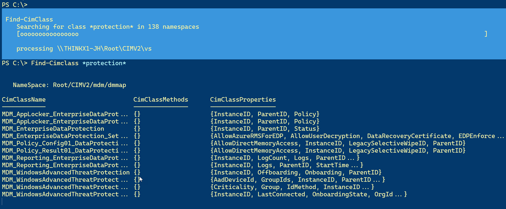
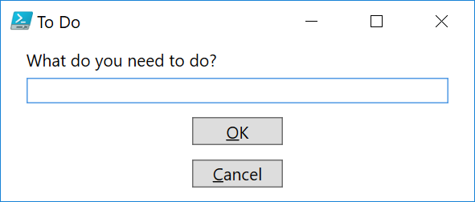
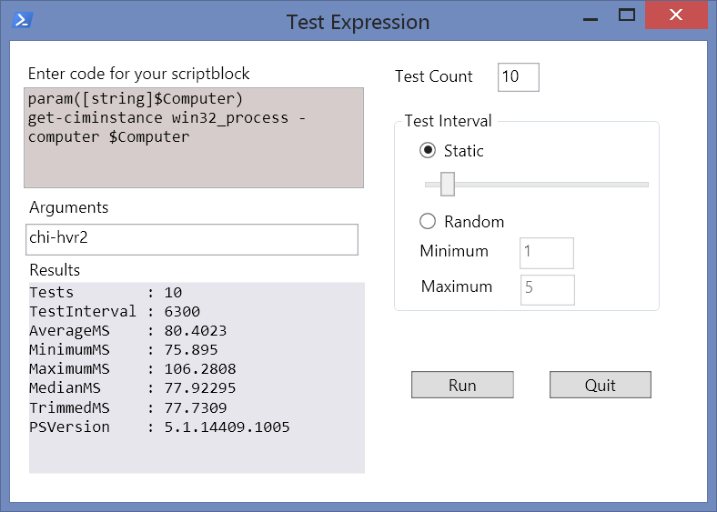
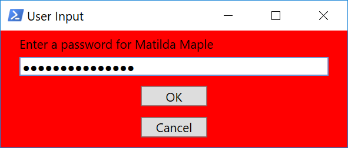
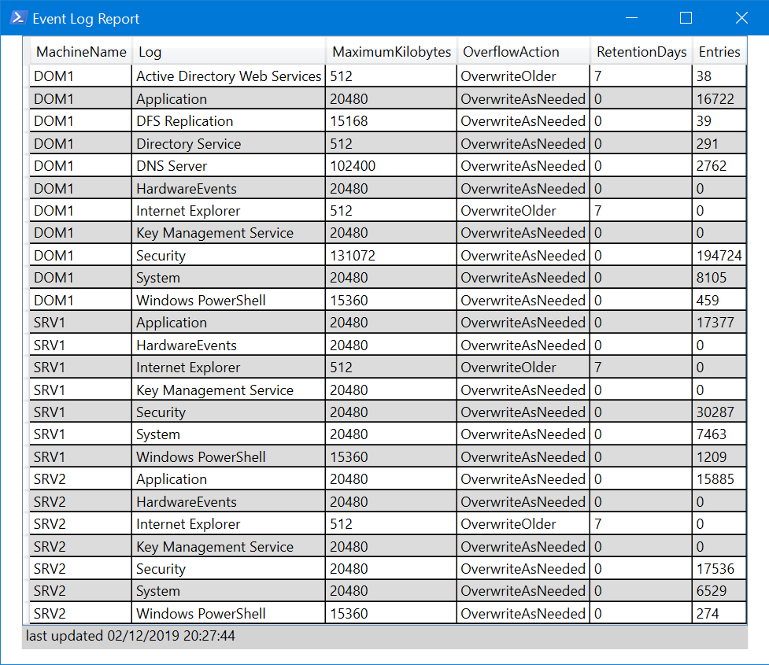
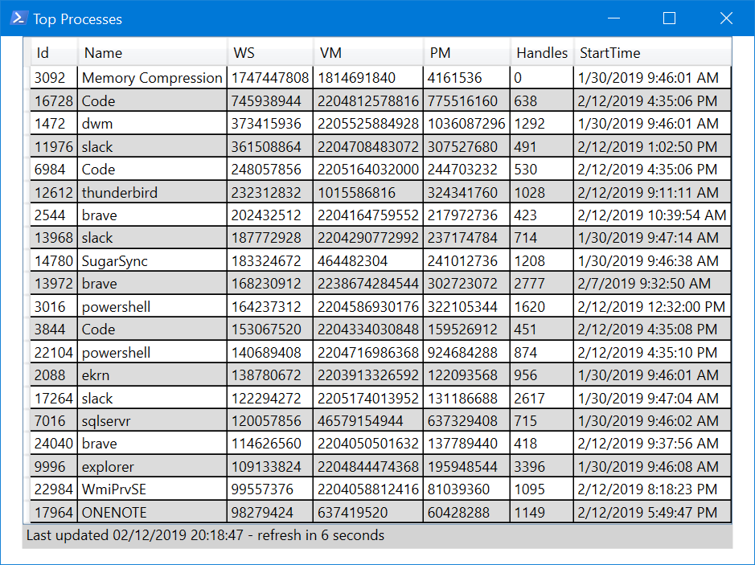
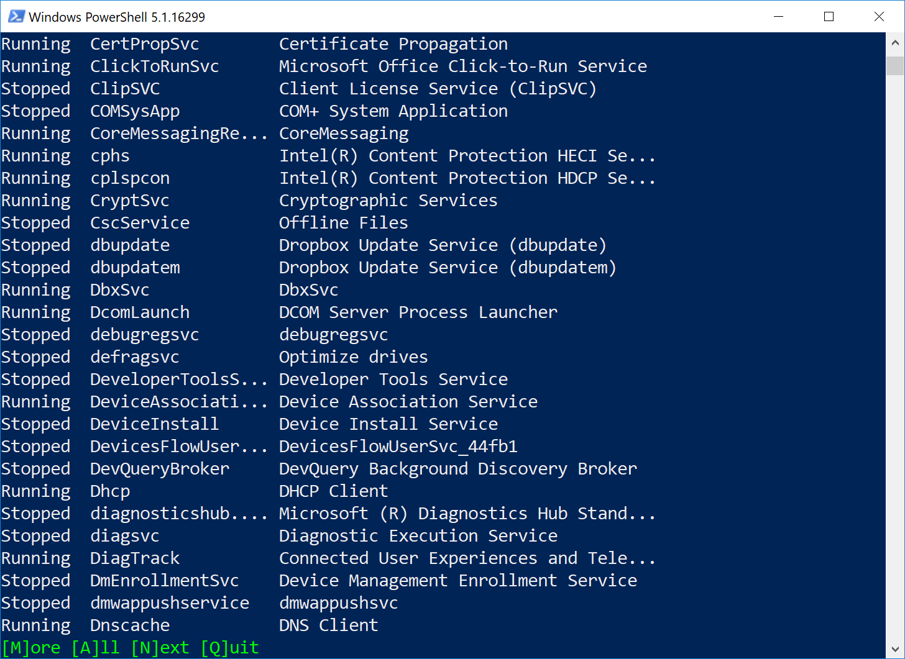
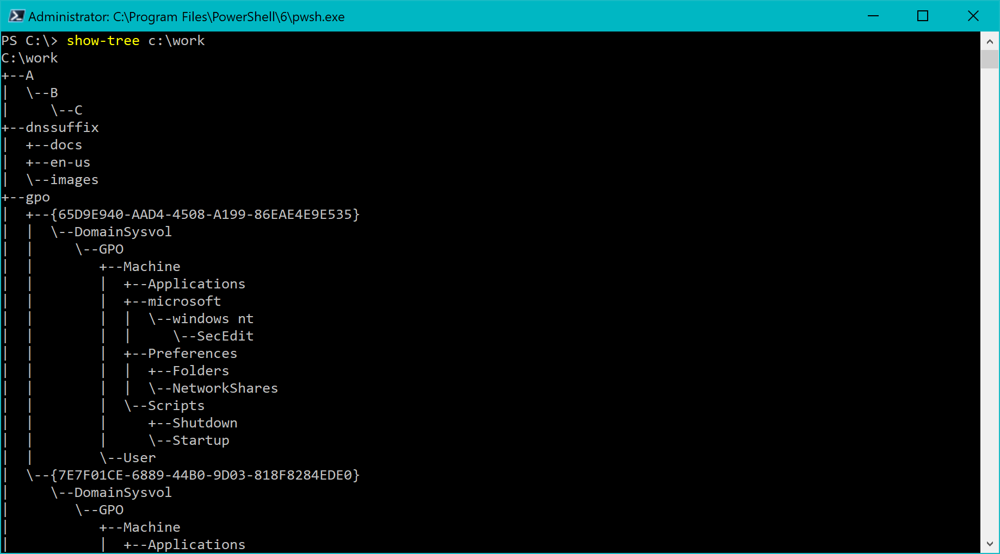

# PSScriptTools

[](https://www.powershellgallery.com/packages/PSScripttools/) [](https://www.powershellgallery.com/packages/PSScripttools/)

This PowerShell module contains a number of functions you might use to enhance your own functions and scripts. The [Samples](./samples) folder contains demonstration script files.

## Current Release

You can get the current release from this repository or install this from the PowerShell Gallery:

```powershell
Install-Module PSScriptTools
```

or in PowerShell 7:

```powershell
Install-Module PSScriptTools -scope CurrentUser
```

Starting in v2.2.0, the module was restructured to better support Desktop and Core editions. But starting with version 2.13.0, the module design has reverted. All commands will be exported. Anything that is platform specific should be handled on a per command basis. It is assumed you will be running this module in Windows PowerShell 5.1 or PowerShell 7.

```powershell
Uninstall-Module PSScriptTools -allversions
```

Please post any questions, problems or feedback in [Issues](https://github.com/jdhitsolutions/PSScriptTools/issues). Any input is greatly appreciated.

## General Tools

### [Convert-EventLogRecord](docs/Convert-EventLogRecord.md)

When you use [Get-WinEvent](https://docs.microsoft.com/en-us/powershell/module/microsoft.powershell.diagnostics/get-winevent?view=powershell-7&WT.mc_id=ps-gethelp), the results are objects you can work with in PowerShell.
However, often times there is additional information that is part of the eventlog record, such as replacement strings, that are used to construct a message.
This additional information is not readily exposed.
You can use this command to convert results of a Get-WinEvent command into a PowerShell custom object with additional information.

```powershell
PS C:\> get-winevent -FilterHashtable @{Logname='System';ID=7045} -MaxEvents 1 | Convert-EventLogRecord


LogName      : System
RecordType   : Information
TimeCreated  : 1/21/2020 3:49:46 PM
ID           : 7045
ServiceName  : Netwrix Account Lockout Examiner
ImagePath    : "C:\Program Files (x86)\Netwrix\Account Lockout Examiner\ALEService.exe"
ServiceType  : user mode service
StartType    : auto start
AccountName  : bovine320\jeff
Message      : A service was installed in the system.

               Service Name:  Netwrix Account Lockout Examiner
               Service File Name:  "C:\Program Files (x86)\Netwrix\Account Lockout Examiner\ALEService.exe"
               Service Type:  user mode service
               Service Start Type:  auto start
               Service Account:  bovine320\jeff
Keywords     : {Classic}
Source       : Service Control Manager
Computername : Bovine320
```

### [Get-WhoIs](docs/Get-WhoIs.md)

This command will retrieve WhoIs information from the ARIN database for a given IPv4 address.

```powershell
PS C:\> get-whois 208.67.222.222 | select-object -Property *

IP                     : 208.67.222.222
Name                   : OPENDNS-NET-1
RegisteredOrganization : Cisco OpenDNS, LLC
City                   : San Francisco
StartAddress           : 208.67.216.0
EndAddress             : 208.67.223.255
NetBlocks              : 208.67.216.0/21
Updated                : 3/2/2012 8:03:18 AM

PS C:\> '1.1.1.1','8.8.8.8','208.67.222.222'| get-whois

Name            IP             RegisteredOrganization                  NetBlocks       Updated
----            --             ----------------------                  ---------       -------
APNIC-1         1.1.1.1        Asia Pacific Network Information Centre 1.0.0.0/8       7/30/2010 8:23:43 AM
LVLT-GOGL-8-8-8 8.8.8.8        Google LLC                              8.8.8.0/24      3/14/2014 3:52:05 PM
OPENDNS-NET-1   208.67.222.222 Cisco OpenDNS, LLC                      208.67.216.0/21 3/2/2012 8:03:18 AM
```

This module includes a custom format file for these results.

### [Compare-Module](docs/Compare-Module.md)

Use this command to compare module versions between what is installed against an online repository like the PSGallery

```powershell
PS C:\> Compare-Module Platyps


Name             : platyPS
OnlineVersion    : 0.14.0
InstalledVersion : 0.14.0,0.12.0,0.11.1,0.10.2,0.9.0
PublishedDate    : 4/3/2019 12:46:30 AM
UpdateNeeded     : False
```

Or you can compare and manage multiple modules.

```powershell
PS C:\> Compare-Module | Where UpdateNeeded | Out-Gridview -title "Select modules to update" -outputMode multiple | Foreach { Update-Module $_.name }
```

This example compares modules and send results to `Out-Gridview`. Use `Out-Gridview` as an object picker to decide what modules to update.

### [Get-WindowsVersion](docs/Get-WindowsVersion.md)

This is a PowerShell version of the `winver.exe` utility. This command uses PowerShell remoting to query the registry on a remote machine to retrieve Windows version information.

```powershell
PS C:\> get-windowsversion -Computername srv1,srv2,win10 -Credential company\artd

ProductName                   EditionID          ReleaseId Build      InstalledUTC          Computername
-----------                   ---------          --------- -----      ------------          ------------
Windows Server 2016 Standard  ServerStandardEval 1607      14393.2273 12/26/2018 4:07:25 PM SRV1
Windows Server 2016 Standard  ServerStandardEval 1607      14393.2273 12/26/2018 4:08:07 PM SRV2
Windows 10 Enterprise Evaluat EnterpriseEval     1703      15063.1387 12/26/2018 4:08:11 PM WIN10
```

#### [Get-WindowsVersionString](docs/Get-WindowsVersionString.md)

This command is a variation of `Get-WindowsVersion` that returns a formatted string with version information.

```powershell
PS C:\> Get-WindowsVersionString
BOVINE320 Windows 10 Pro Version Professional (OS Build 17763.253)

```

### [New-PSDriveHere](docs/New-PSDriveHere.md)

This function will create a new PSDrive at the specified location. The default is the current location, but you
can specify any PSPath. The function will take the last word of the path and use it as the name of the new
PSDrive.

```powershell
PS C:\users\jeff\documents\Enterprise Mgmt Webinar> new-psdrivehere

Name           Used (GB)     Free (GB) Provider      Root                                 CurrentLocation
----           ---------     --------- --------      ----                                 ---------------
Webinar                         146.57 FileSystem    C:\users\jeff\Documents\Enter...
```

### [Get-MyVariable](docs/Get-MyVariable.md)

This function will return all variables not defined by PowerShell or by this function itself. The default is to
return all user-created variables from the global scope but you can also specify a scope such as script, local or
a number 0 through 5.

```powershell
PS C:\> Get-MyVariable

NName Value                  Type
---- -----                  ----
a    bits                   ServiceController
dt   10/22/2018 10:49:38 AM DateTime
foo  123                    Int32
r    {1, 2, 3, 4...}        Object[]
...
```

Depending on the value and how PowerShell chooses to display it, you may not see the type.

### [ConvertFrom-Text](docs/ConvertFrom-Text.md)

This command can be used to convert text from a file or a command line tool into objects. It uses a regular expression pattern with named captures and turns the result into a custom object. You have the option of specifying a typename in case you are using custom format files.

```powershell
PS C:\> $arp = '(?<IPAddress>(\d{1,3}\.){3}\d{1,3})\s+(?<MAC>(\w{2}-){5}\w{2})\s+(?<Type>\w+$)'
PS C:\> arp -g -N 172.16.10.22 | select -skip 3 | foreach {$_.Trim()} | ConvertFrom-Text $arp -TypeName arpData -NoProgress

IPAddress          MAC                        Type
---------          ---                        ----
172.16.10.1        b6-fb-e4-16-41-be       dynamic
172.16.10.100      00-11-32-58-7b-10       dynamic
172.16.10.115      5c-aa-fd-0c-bf-fa       dynamic
172.16.10.120      5c-1d-d9-58-81-51       dynamic
172.16.10.159      3c-e1-a1-17-6d-0a       dynamic
172.16.10.162      00-0e-58-ce-8b-b6       dynamic
172.16.10.178      00-0e-58-8c-13-ac       dynamic
172.16.10.185      d0-04-01-26-b5-61       dynamic
172.16.10.186      e8-b2-ac-95-92-98       dynamic
172.16.10.197      fc-77-74-9f-f4-2f       dynamic
172.16.10.211      14-20-5e-93-42-fb       dynamic
172.16.10.222      28-39-5e-3b-04-33       dynamic
172.16.10.226      00-0e-58-e9-49-c0       dynamic
172.16.10.227      48-88-ca-e1-a6-00       dynamic
172.16.10.239      5c-aa-fd-83-f1-a4       dynamic
172.16.255.255     ff-ff-ff-ff-ff-ff        static
224.0.0.2          01-00-5e-00-00-02        static
224.0.0.7          01-00-5e-00-00-07        static
224.0.0.22         01-00-5e-00-00-16        static
224.0.0.251        01-00-5e-00-00-fb        static
224.0.0.252        01-00-5e-00-00-fc        static
239.255.255.250    01-00-5e-7f-ff-fa        static
```

This example uses a previously created and import format.ps1xml file for the custom type name.

### [Get-PSWho](docs/Get-PSWho.md)

This command will provide a summary of relevant information for the current user in a PowerShell Session. You might use this to troubleshoot an end-user problem running a script or command.

```powershell
PS C:\> Get-PSWho

User            : BOVINE320\Jeff
Elevated        : True
Computername    : BOVINE320
OperatingSystem : Microsoft Windows 10 Pro [64-bit]
OSVersion       : 10.0.18363
PSVersion       : 5.1.18362.145
Edition         : Desktop
PSHost          : ConsoleHost
WSMan           : 3.0
ExecutionPolicy : RemoteSigned
Culture         : English (United States)
```

### [Find-CimClass](docs/Find-CimClass.md)

This function is designed to search an entire CIM repository for a class name. Sometimes, you may have a guess about a class name but not know the full name or even the correct namespace. `Find-CimClass` will recursively search for a given classname. You can use wildcards and search remote computers.



### [Out-VerboseTee](docs/Out-VerboseTee.md)

This command is intended to let you see your verbose output and write the verbose messages to a log file. It will only work if the verbose pipeline is enabled, usually when your command is run with -Verbose. This function is designed to be used within your scripts and functions. You either have to hard code a file name or find some other way to define it in your function or control script. You could pass a value as a parameter or set it as a `PSDefaultParameterValue`.

This command has aliases of `Tee-Verbose` and `tv`.

```powershell
Begin {
    $log = New-RandomFilename -useTemp -extension log
    Write-Detail "Starting $($myinvocation.mycommand)" -Prefix begin | Tee-Verbose $log
    Write-Detail "Logging verbose output to $log" -prefix begin | Tee-Verbose -append
    Write-Detail "Initializing data array" -Prefix begin | Tee-Verbose $log -append
    $data = @()
} #begin
```

When the command is run with -Verbose you will see the verbose output **and** it will be saved to the specified log file.

### [Remove-Runspace](docs/Remove-Runspace.md)

During the course of your PowerShell work, you may discover that some commands and scripts can leave behind runspaces such as `ConvertTo-WPFGrid`. You may even deliberately be creating additional runspaces. These runspaces will remain until you exit your PowerShell session. Or use this command to cleanly close and dispose of runspaces.

```powershell
PS C:\> Get-RunSpace | where ID -gt 1 | Remove-RunSpace
```

Get all runspaces with an ID greater than 1, which is typically your current session, and remove the runspace.

### [Get-PSLocation](docs/Get-PSLocation.md)

A simple function to get common locations. This can be useful with cross-platform scripting.


### [Get-PowerShellEngine](docs/Get-PowerShellEngine.md)

Use this command to quickly get the path to the PowerShell executable. In Windows you should get a result like this:

```powershell
PS C:\> Get-PowerShellEngine
C:\Windows\System32\WindowsPowerShell\v1.0\powershell.exe
```

But PowerShell on non-Windows platforms is a bit different:

```powershell
PS /home/jhicks> Get-PowerShellEngine
/opt/microsoft/powershell/7/pwsh
```

You can also get detailed information.


Results will vary depending on whether you are running PowerShell on Windows nor non-Windows systems.

## File Tools

### [Test-EmptyFolder](docs/Test-EmptyFolder.md)

This command will test if a given folder path is empty of all files anywhere in the path.
This includes hidden files.
The command will return True even if there are empty sub-folders.
The default output is True or False but you can use -Passthru to get more information.

```powershell
PS C:\> Get-Childitem c:\work -Directory | test-EmptyFolder -passthru | Where-object {$_.Isempty} | Foreach-Object { Remove-Item -LiteralPath $_.path -Recurse -force -whatif}
What if: Performing the operation "Remove Directory" on target "C:\work\demo3".
What if: Performing the operation "Remove Directory" on target "C:\work\installers".
What if: Performing the operation "Remove Directory" on target "C:\work\new".
What if: Performing the operation "Remove Directory" on target "C:\work\sqlback".
What if: Performing the operation "Remove Directory" on target "C:\work\todd".
What if: Performing the operation "Remove Directory" on target "C:\work\[data]".
```

Find all empty sub-folders under C:\Work and pipe them to Remove-Item.
This is one way to remove empty folders.
The example is piping objects to ForEach-Object so that Remove-Item can use the -LiteralPath parameter, because C:\work\[data] is a non-standard path.

### [Get-FolderSizeInfo](docs/Get-FolderSizeInfo.md)

Use this command to quickly get the size of a folder. You also have an option to include hidden files. The command will measure all files in all subdirectories. The command includes a format file with additional view to display the total size in MB or GB.

```powershell
PS C:\> Get-Childitem D:\ -Directory | Get-FolderSizeInfo -Hidden | Where-Object TotalSize -gt 1gb | Sort-Object TotalSize -Descending | format-table -View gb

Computername    Path                                                TotalFiles   TotalSizeGB
------------    ----                                                ----------   -----------
BOVINE320       D:\Autolab                                                 159      137.7192
BOVINE320       D:\VMDisks                                                  18      112.1814
BOVINE320       D:\ISO                                                      17       41.5301
BOVINE320       D:\FileHistory                                          104541       36.9938
BOVINE320       D:\Vagrant                                                  13       19.5664
BOVINE320       D:\Vms                                                      83        5.1007
BOVINE320       D:\2016                                                   1130        4.9531
BOVINE320       D:\video                                                   125         2.592
BOVINE320       D:\blog                                                  21804        1.1347
BOVINE320       D:\pstranscripts                                        122092        1.0914
```

### [Optimize-Text](docs/Optimize-Text.md)

Use this command to clean and optimize content from text files. Sometimes text files have blank lines or the content has trailing spaces. These sorts of issues can cause problems when passing the content to other commands.

This command will strip out any lines that are blank or have nothing by white space, and trim leading and trailing spaces. The optimized text is then written back to the pipeline. Optionally, you can specify a property name. This can be useful when your text file is a list of computer names and you want to take advantage of pipeline binding.

### [Get-FileItem](docs/Get-FileItem.md)

A PowerShell version of the CLI `where.exe` command. You can search with a simple or regex pattern.

```powershell
PS C:\> pswhere winword.exe -Path c:\ -Recurse -first

C:\Program Files\Microsoft Office\root\Office16\WINWORD.EXE
```

Note that you might see errors for directories where you don't have access permission. This is normal.

### [New-CustomFileName](docs/New-CustomFileName.md)

This command will generate a custom file name based on a template string that you provide.

```powershell
PS C:\> New-CustomFileName %computername_%day%monthname%yr-%time.log
COWPC_28Nov19-142138.log

PS C:\> New-CustomFileName %dayofweek-%####.dat
Tuesday-3128.dat
```

You can create a template string using any of these variables. Most of these should be self-explanatory

- %username
- %computername
- %year  - 4 digit year
- %yr  - 2 digit year
- %monthname - The abbreviated month name
- %month  - The month number
- %dayofweek - The full name of the week day
- %day
- %hour
- %minute
- %time
- %string - A random string
- %guid

You can also insert a random number using %### with a # character for each digit. If you want a 2 digit random number use %##. If you want 6 digits, use %######.

### [New-RandomFileName](docs/New-RandomFileName.md)

Create a new random file name. The default is a completely random name including the extension.

```powershell
PS C:\> new-randomfilename
fykxecvh.ipw
```

But you can specify an extension.

```powershell
PS C:\> new-randomfilename -extension dat
emevgq3r.dat
```

Optionally you can create a random file name using the TEMP folder or your HOME folder. On Windows platforms this will default to your Documents folder.

```powershell
PS C:\> new-randomfilename -extension log -UseHomeFolder
C:\Users\Jeff\Documents\kbyw4fda.log
```

On Linux machines it will be the home folder.

```powershell
PS /mnt/c/scripts> new-randomfilename -home -Extension tmp
/home/jhicks/oces0epq.tmp
```

### [ConvertTo-Markdown](docs/ConvertTo-Markdown.md)

This command is designed to accept pipelined output and create a markdown document. The pipeline output will formatted as a text block or a table You can optionally define a title, content to appear before the output and content to appear after the output. You can run a command like this:

```powershell
 Get-Service Bits,Winrm | Convertto-Markdown -title "Service Check" -precontent "## $($env:computername)"  -postcontent "_report $(Get-Date)_"
 ```

which generates this markdown:

```markdown
    # Service Check

    ## BOVINE320

    ```text

    Status   Name               DisplayName
    ------   ----               -----------+
    Running  Bits               Background Intelligent Transfer Ser...
    Running  Winrm              Windows Remote Management (WS-Manag...
    ```

    _report 09/25/2019 09:57:12_
```

Because the function writes markdown to the pipeline you will need to pipe it to a command `Out-File` to create a file.

## ToDo

Because this module is intended to make scripting easier for you, it adds options to insert ToDo statements into PowerShell files. If you are using the PowerShell ISE or VS Code and import this module, it will add the capability to insert a line like this:

```text
    # [12/13/2018 16:52:40] TODO: Add parameters
```

In the PowerShell ISE, you will get a new menu under Add-Ons.


You can use the menu or keyboard shortcut which will launch an input box.



The comment will be inserted at the current cursor location.

In VS Code, access the command palette (Ctrl+Shift+P) and then `PowerShell: Show Additional Commands from PowerShell Modules`. Select `Insert ToDo` from the list and you'll get the same input box. Note that this will only work for PowerShell files.

## [Test-Expression](docs/Test-Expression.md)

The primary command can be used to test a PowerShell expression or scriptblock for a specified number of times and calculate the average runtime, in milliseconds, over all the tests.

### Why

When you run a single test with `Measure-Command` the result might be affected by any number of factors. Likewise, running multiple tests may also be influenced by things such as caching. The goal in this module is to provide a test framework where you can run a test repeatedly with either a static or random interval between each test. The results are aggregated and analyzed. Hopefully, this will provide a more meaningful or realistic result.

### Examples

The output will also show the median and trimmed values as well as some metadata about the current PowerShell session.

```powershell
PS C:\> $cred = Get-credential globomantics\administrator
PS C:\> Test-Expression {param($cred) get-wmiobject win32_logicaldisk -computer chi-dc01 -credential $cred } -argumentList $cred

Tests        : 1
TestInterval : 0.5
AverageMS    : 1990.6779
MinimumMS    : 1990.6779
MaximumMS    : 1990.6779
MedianMS     : 1990.6779
TrimmedMS    :
PSVersion    :5.1.17763.134
OS           : Microsoft Windows 10 Pro
```

You can also run multiple tests with random time intervals.

```powershell
PS C:\>Test-Expression {param([string[]]$Names) get-service $names} -count 5 -IncludeExpression -argumentlist @('bits','wuauserv','winrm') -RandomMinimum .5 -RandomMaximum 5.5

Tests        : 5
TestInterval : Random
AverageMS    : 1.91406
MinimumMS    : 0.4657
MaximumMS    : 7.5746
MedianMS     : 0.4806
TrimmedMS    : 0.51
PSVersion    : 5.1.17763.134
OS           : Microsoft Windows 10 Pro
Expression   : param([string[]]$Names) get-service $names
Arguments    : {bits, wuauserv, winrm}
```

For very long running tests, you can run them as a background job.

### Graphical Testing

The module also includes a graphical command called `Test-ExpressionForm`. This is intended to serve as both an entry and results form.



When you quit the form the last result will be written to the pipeline including all metadata, the scriptblock and any arguments.

## Graphical Tools

### [Invoke-InputBox](docs/Invoke-InputBox.md)

This function is a graphical replacement for `Read-Host`. It creates a simple WPF form that you can use to get user input. The value of the text box will be written to the pipeline.

```powershell
$name = Invoke-InputBox -Prompt "Enter a user name" -Title "New User Setup"
```


You can also capture a secure string.

```powershell
Invoke-Inputbox -Prompt "Enter a password for $Name" -AsSecureString -BackgroundColor red
```



This example also demonstrates that you can change form's background color. This function will **not** work in PowerShell Core.

### [New-WPFMessageBox](docs/New-WPFMessageBox.md)

This function creates a Windows Presentation Foundation (WPF) based message box. This is intended to replace the legacy MsgBox function from VBScript and the Windows Forms library. The command uses a set of predefined button sets, each of which will close the form and write a value to the pipeline.

- OK     = 1
- Cancel = 0
- Yes    = $True
- No     = $False

You can also create an ordered hashtable of your own buttons and values. It is assumed you will typically use this function in a script where you can capture the output and take some action based on the value.

```powershell
PS C:\> New-WPFMessageBox -Message "Are you sure you want to do this?" -Title Confirm -Icon Question -ButtonSet YesNo
```


You can also create your own custom button set as well as modify the background color.

```powershell
PS C:\> New-WPFMessageBox -Message "Select a system option from these choices:" -Title "You Decide" -Background cornsilk -Icon Warning -CustomButtonSet ([ordered]@{"Reboot"=1;"Shutdown"=2;"Cancel"=3})
```


### [ConvertTo-WPFGrid](docs/ConvertTo-WPFGrid.md)

This command is an alternative to `Out-Gridview`. It works much the same way. Run a PowerShell command and pipe it to this command. The output will be displayed in an auto-sized data grid. You can click on column headings to sort. You can resize columns and you can re-order columns.

```powershell
get-eventlog -list -ComputerName DOM1,SRV1,SRV2 |
Select Machinename,Log,MaximumKilobytes,Overflowaction,
@{Name="RetentionDays";Expression={$_.MinimumRetentionDays}},
@{Name="Entries";Expression = {$_.entries.count}} |
ConvertTo-WPFGrid -Title "Event Log Report"
```



You can also have automatically refresh the data.

```powershell
get-process | sort-object WS -Descending | Select -first 20 ID,Name,WS,VM,PM,Handles,StartTime |
Convertto-WPFGrid -Refresh -timeout 20 -Title "Top Processes"
```



Note that in v2.4.0 the form layout was modified and may not be reflected in these screen shots.

## Hashtable Tools

### [Convert-CommandtoHashtable](docs/Convert-CommandtoHashtable.md)

This command is intended to convert a long PowerShell expression with named parameters into a splatting
alternative.

```powershell
PS C:\> Convert-CommandtoHashtable -Text "get-eventlog -listlog -computername a,b,c,d -erroraction stop"

$paramHash = @{
  listlog = $True
   computername = "a","b","c","d"
   erroraction = "stop"
}

Get-EventLog @paramHash
```

### [Convert-HashtableString](docs/Convert-HashtableString.md)

This function is similar to `Import-PowerShellDataFile`. But where that command can only process a file, this command
will take any hashtable-formatted string and convert it into an actual hashtable.

```powershell
PS C:\> get-content c:\work\test.psd1 | unprotect-cmsmessage | Convert-HashtableString

Name                           Value
----                           -----
CreatedBy                      BOVINE320\Jeff
CreatedAt                      10/02/2018 21:28:47 UTC
Computername                   Think51
Error
Completed                      True
Date                           10/02/2018 21:29:35 UTC
Scriptblock                    restart-service spooler -force
CreatedOn                      BOVINE320
```

The test.psd1 file is protected as a CMS Message. In this example, the contents are decoded as a string which is then in turn converted into an actual hashtable.

### [Convert-HashTableToCode](docs/Convert-HashTableToCode.md)

Use this command to convert a hashtable into its text or string equivalent.

```powershell
PS C:\> $h = @{Name="SRV1";Asset=123454;Location="Omaha"}
PS C:\> convert-hashtabletocode $h
@{
        Name = 'SRV1'
        Asset = 123454
        Location = 'Omaha'
}
```

Convert a hashtable object to a string equivalent that you can copy into your script.

### [ConvertTo-HashTable](docs/ConvertTo-HashTable.md)

This command will take an object and create a hashtable based on its properties. You can have the hashtable exclude some properties as well as properties that have no value.

```powershell
PS C:\> Get-Process -id $pid | select name,id,handles,workingset | ConvertTo-HashTable

Name                           Value
----                           -----
WorkingSet                     418377728
Name                           powershell_ise
Id                             3456
Handles                        958
```

### [Join-HashTable](docs/Join-HashTable.md)

This command will combine two hashtables into a single hashtable.Join-Hashtable will test for duplicate keys. If any of the keys from the first, or primary hashtable are found in the secondary hashtable, you will be prompted for which to keep. Or you can use -Force which will always keep the conflicting key from the first hashtable.

```powershell
PS C:\> $a=@{Name="Jeff";Count=3;Color="Green"}
PS C:\> $b=@{Computer="HAL";Enabled=$True;Year=2020;Color="Red"}
PS C:\> join-hashtable $a $b
Duplicate key Color
A Green
B Red
Which key do you want to KEEP \[AB\]?: A

Name                           Value
----                           -----
Year                           2020
Name                           Jeff
Enabled                        True
Color                          Green
Computer                       HAL
Count                          3
```

### [Rename-Hashtable](docs/Rename-HashTable.md)

This command allows you to rename a key in an existing hashtable or ordered dictionary object.

```powershell
PS C:\> $h = Get-Service Spooler | ConvertTo-HashTable
```

The hashtable in $h has Machinename property which can be renamed.

```powershell
PS C:\> Rename-HashTable -Name h -Key Machinename -NewKey Computername -Passthru

Name                           Value
----                           -----
ServiceType                    Win32OwnProcess, InteractiveProcess
ServiceName                    Spooler
Container
CanPauseAndContinue            False
RequiredServices               {RPCSS, http}
ServicesDependedOn             {RPCSS, http}
Computername                   .
CanStop                        True
StartType                      Automatic
Site
ServiceHandle                  SafeServiceHandle
DisplayName                    Print Spooler
CanShutdown                    False
Status                         Running
Name                           Spooler
DependentServices              {Fax}
```

## Select Functions

The module contains 2 functions which simplify the use of `Select-Object`. The commands are intended to make it easier to select the first or last X number of objects. The commands include features so that you can sort the incoming objects on a given property first.

```powershell
PS C:\> get-process | select-first 5 -Property WS -Descending

Handles  NPM(K)    PM(K)      WS(K)     CPU(s)     Id  SI ProcessName
-------  ------    -----      -----     ------     --  -- -----------
    696      89   615944     426852     391.97   7352   0 sqlservr
    541      78   262532     274576     278.41   6208   8 Code
   1015      70   227824     269504     137.39  16484   8 powershell_ise
   1578     111   204852     254640      98.58  21332   8 firefox
    884      44   221872     245712     249.23  12456   8 googledrivesync
```

## Time Functions

The module has a few date and time related commands.

### [ConvertTo-UTCTime](docs/ConvertTo-UTCTime.md)

Convert a local datetime value to universal time. The default is to convert now but you can specify a datetime value.

```powershell
PS C:\> ConvertTo-UTCTime

Monday, March 4, 2019 5:51:26 PM
```

Convert a datetime that is UTC-5 to universal time.

### [ConvertFrom-UTCTime](docs/ConvertFrom-UTCTime.md)

```powershell
PS C:\> ConvertFrom-UTCTime "3/4/2019 6:00PM"

Monday, March 4, 2019 1:00:00 PM
```

Convert a universal datetime to the local time.

### [Get-MyTimeInfo](docs/Get-MyTimeInfo.md)

Display a time settings for a collection of locations. This command is a PowerShell equivalent of a world clock. It will display a datetime value against a collection of locations. You can specify an ordered hashtable of locations and time zones. You can run command like:

```powershell
[System.TimeZoneinfo]::GetSystemTimeZones() | out-gridview
```

or

```powershell
Get-TimeZone -listavailable
```

To discover time zone names. Note that the ID is case-sensitive. You can then use the command like this:

```powershell
PS C:\> Get-MyTimeInfo -Locations ([ordered]@{Seattle="Pacific Standard time";"New Zealand" = "New Zealand Standard Time"}) -HomeTimeZone "central standard time" | Select Now,Home,Seattle,'New Zealand'

Now                 Home                 Seattle              New Zealand
---                 ----                 -------              -----------
3/4/2019 1:18:36 PM 3/4/2019 12:18:36 PM 3/4/2019 10:18:36 AM 3/5/2019 7:18:36 AM
```

This is a handy command when traveling and your laptop is using a locally derived time and you want to see the time in other locations. It is recommended that you set a PSDefaultParameter value for the HomeTimeZone parameter in your PowerShell profile.

### [ConvertTo-LocalTime](docs/ConvertTo-LocalTime.md)

It can be tricky sometimes to see a time in a foreign location and try to figure out what that time is locally. This command attempts to simplify this process. In addition to the remote time, you need the base UTC offset for the remote location.

```powershell
PS C:\> get-timezone -ListAvailable | where id -match hawaii


Id                         : Hawaiian Standard Time
DisplayName                : (UTC-10:00) Hawaii
StandardName               : Hawaiian Standard Time
DaylightName               : Hawaiian Daylight Time
BaseUtcOffset              : -10:00:00
SupportsDaylightSavingTime : False

PS C:\> Convertto-LocalTime "10:00AM" -10:00:00

Thursday, March 14, 2019 4:00:00 PM
```

In this example, the user if first determining the UTC offset for Hawaii. Then 10:00AM in say Honolulu, is converted to local time which in this example is in the Eastern Time zone.

### [Get-TZList](docs/Get-TZList.md)

This command uses a free and publicly available REST API offered by [http://worldtimeapi.org](http://worldtimeapi.org) to get a list of time zone areas. You can get a list of all areas or by geographic location. Use Get-TZData to then retrieve details.

```powershell
PS S:\PSScriptTools> get-tzlist Australia
Australia/Adelaide
Australia/Brisbane
Australia/Broken_Hill
Australia/Currie
Australia/Darwin
Australia/Eucla
Australia/Hobart
Australia/Lindeman
Australia/Lord_Howe
Australia/Melbourne
Australia/Perth
Australia/Sydney
```

### [Get-TZData](docs/Get-TZData.md)

This command also uses the API from worldtimeapi.org to retrieve details about a give time zone area.

```powershell
PS C:\> Get-TZData Australia/Hobart

Timezone                        Label        Offset     DST                  Time
--------                        -----        ------     ---                  ----
Australia/Hobart                AEDT       11:00:00    True  3/16/2019 3:43:14 AM
```

The Time value is the current time at the remote location. The command presents a formatted object but you can also get the raw data.

```powershell
PS C:\> Get-TZData Australia/Hobart -Raw


week_number  : 11
utc_offset   : +11:00
unixtime     : 1552668285
timezone     : Australia/Hobart
dst_until    : 2019-04-06T16:00:00+00:00
dst_from     : 2018-10-06T16:00:00+00:00
dst          : True
day_of_year  : 75
day_of_week  : 6
datetime     : 2019-03-16T03:44:45.689655+11:00
abbreviation : AEDT
```

### [ConvertTo-LexicalTime](docs/ConvertTo-LexicalTime.md)

When working with timespans or durations in XML files, such as those from scheduled tasks, the format is a little different than what you mgiht expect. The specification is described at [https://www.w3.org/TR/xmlschema-2/#duration](https://www.w3.org/TR/xmlschema-2/#duration). Use this command to convert a timespan into a lexical format you can use in an XML file where you need to specify a duration.

```powershell
ConvertTo-LexicalTimespan (New-TimeSpan -Days 7 -hours 12)

P7DT12H
```

### [ConvertFrom-LexicalTime](docs/ConvertFrom-LexicalTime.md)

Likewise, you might need to convert a lexical value back into a timespan.

```powershell
ConvertFrom-LexicalTimespan P7DT12H


Days              : 7
Hours             : 12
Minutes           : 0
Seconds           : 0
Milliseconds      : 0
Ticks             : 6480000000000
TotalDays         : 7.5
TotalHours        : 180
TotalMinutes      : 10800
TotalSeconds      : 648000
TotalMilliseconds : 648000000

```

These functions were first described at [https://jdhitsolutions.com/blog/powershell/7101/converting-lexical-timespans-with-powershell/](https://jdhitsolutions.com/blog/powershell/7101/converting-lexical-timespans-with-powershell/)

## Console Utilities

### [Out-More](docs/Out-More.md)

This command provides a PowerShell alternative to the cmd.exe **MORE** command, which doesn't work in the PowerShell ISE. When you have screens of information, you can page it with this function.

```powershell
get-service | out-more
```



This also works in PowerShell Core.

### [Out-ConditionalColor](docs/Out-ConditionalColor.md)

This command is designed to take pipeline input and display it in a colorized format,based on a set of conditions. Unlike `Write-Host` which doesn't write to the pipeline, this command will write to the pipeline.

You can use a simple hashtable to define a color if the given property matches the hashtable key.


Or you can specify an ordered hashtable for more complex processing.


This command doesn't always work depending on the type of object you pipe to it. The problem appears to be related to the formatting system. Development and testing is ongoing.

### [Set-ConsoleTitle](docs/Set-ConsoleTitle.md)

Set the title bar of the current PowerShell console window.

```powershell
PS C:\> if (Test-IsAdministrator) { Set-ConsoleTitle "Administrator: $($PSVersionTable.PSedition) $($PSVersionTable.PSVersion)" -Verbose }
VERBOSE: [10:33:17.0420820 BEGIN  ] Starting Set-ConsoleTitle
VERBOSE: [10:33:17.0440568 PROCESS] Setting console title to Administrator: Desktop 5.1.17763.316
VERBOSE: Performing the operation "Set-ConsoleTitle" on target "Administrator: Desktop 5.1.17763.316".
VERBOSE: [10:33:17.0584056 END    ] Ending Set-ConsoleTitle
```

### [Set-ConsoleColor](docs/Set-ConsoleColor.md)

Configure the foreground or background color of the current PowerShell console window. Note that if you are running the PSReadline module, this command won't work. You should use `Set-PSReadlineOption` or similar command to configure your session settings.

```powershell
PS C:\> Set-ConsoleColor -background DarkGray -foreground Yellow
```

### [Add-Border](docs/Add-Border.md)

This command will create a character or text based border around a line of text. You might use this to create a formatted text report or to improve the display of information to the screen.

```powershell
PS C:\> add-border $env:computername

*************
*   COWPC   *
*************
```

### [Show-Tree](docs/Show-Tree.md)

Shows the specified path as a graphical tree in the console. This is intended as PowerShell alternative to the tree DOS command. This function should work for any type of PowerShell provider and can be used to explore providers used for configuration like the WSMan provider or the registry.

By default, the output will only show directory or equivalent structures. But you can opt to include items well as item details.



## Format-Functions

A set of simple commands to make it easier to format values.

### [Format-Percent](docs/Format-Percent.md)

Treat a value as a percentage. This will write a [double] and not include the % sign.

```powershell
PS C:\> format-percent -Value 123.5646MB -total 1GB -Decimal 4
12.0669
```

### [Format-String](docs/Format-String.md)

Use this command to perform one of several string manipulation "tricks".

```powershell
PS C:\> format-string "powershell" -Reverse -Case Proper
Llehsrewop
PS C:\> format-string PowerShell -Randomize
wSlhoeePlr
PS C:\> format-string "!MySecretPWord" -Randomize -Replace @{S="$";e=&{Get-Random -min 1 -max 9};o="^"} -Reverse
yr7!^7WcMtr$Pd
```

### [Format-Value](docs/Format-Value.md)

This command will format a given numeric value. By default it will treat the number as an integer. Or you can specify a certain number of decimal places. The command will also allow you to format the value in KB, MB, etc.

```powershell
PS C:\>  format-value 1235465676 -Unit kb
1206509
PS C:\> format-value 123.45 -AsCurrency
$123.45
PS C:\> (get-process | measure ws -sum).sum | format-value -Unit mb | format-value -AsNumber
9,437
```

Or pull it all together:

```powershell
PS C:\> Get-CimInstance win32_operatingsystem |
select-object @{Name = "TotalMemGB";Expression={Format-Value $_.TotalVisibleMemorySize -Unit mb}},
@{Name="FreeMemGB";Expression={Format-Value $_.FreePhysicalMemory -unit mb -Decimal 2}},
@{Name="PctFree";Expression={Format-Percent -Value $_.FreePhysicalMemory -Total $_.totalVisibleMemorySize -Decimal 2}}

TotalMemGB FreeMemGB PctFree
---------- --------- -------
        32     14.05   44.06
```

## Scripting Tools

### [Test-WithCulture](docs/Test-WithCulture.md)

When writing PowerShell commands, sometimes the culture you are running under becomes critical. For example, European countries use a different datetime format than North Americans which might present a problem with your script or command. Unless you have a separate computer running under the foreign culture, it is difficult to test. This command will allow you to test a scriptblock or even a file under a different culture, such as DE-DE for German.

```powershell
PS C\> Test-WithCulture fr-fr -Scriptblock {
    Get-winEvent -log system -max 500 |
    Select-Object -Property TimeCreated,ID,OpCodeDisplayname,Message |
    Sort-Object -property TimeCreated |
    Group-Object {$_.TimeCreated.ToShortDateString()} -NoElement }

Count Name
----- ----
  165 10/07/2019
  249 11/07/2019
   17 12/07/2019
   16 13/07/2019
   20 14/07/2019
   26 15/07/2019
    7 16/07/2019
```

### [Copy-Command](docs/Copy-Command.md)

This command will copy a PowerShell command, including parameters and help to a new user-specified command. You can use this to create a "wrapper" function or to easily create a proxy function. The default behavior is to create a copy of the command complete with the original comment-based help block.

### [Get-ParameterInfo](docs/Get-ParameterInfo.md)

Using Get-Command, this function will return information about parameters for any loaded cmdlet or function. The common parameters like Verbose and ErrorAction are omitted. Get-ParameterInfo returns a custom object with the most useful information an administrator might need to know.

```powershell
PS C:\> Get-ParameterInfo -Command Get-Counter -Parameter computername


Name                            : computername
Aliases                         : Cn
Mandatory                       : False
Position                        : Named
ValueFromPipeline               : False
ValueFromPipelineByPropertyName : False
Type                            : System.String[]
IsDynamic                       : False
ParameterSet                    : __AllParameterSets
```

### [New-PSFormatXML](docs/New-PSFormatXML.md)

When defining custom objects with a new typename, PowerShell by default will display all properties. However, you may wish to have a specific default view, be it a table or list. Or you may want to have different views display the object differently. Format directives are stored in format.ps1xml files which can be tedious to create. This command simplifies that process.

Define a custom object:

```powershell
$tname = "myThing"
$obj = [PSCustomObject]@{
    PSTypeName   = $tname
    Name         = "Jeff"
    Date         = (Get-Date)
    Computername = $env:computername
    OS           = (Get-CimInstance win32_operatingsystem -Property Caption).caption
}
Update-TypeData -TypeName $tname -MemberType "ScriptProperty" -MemberName "Runtime" -value {(Get-Date) - [datetime]"1/1/2019"} -force
```

The custom object looks like this by default:

```powershell
PS C:\> $obj

Name         : Jeff
Date         : 2/10/2019 8:49:10 PM
Computername : BOVINE320
OS           : Microsoft Windows 10 Pro
Runtime      : 40.20:49:43.9205882
```

Now you can create new formatting directives.

```powershell
PS C:\> $obj | New-PSFormatXML -Properties Name, Date, Computername, OS -FormatType Table -path "C:\work\$tname.format.ps1xml"
PS C:\> $obj | New-PSFormatXML -Properties Name, OS, Runtime -FormatType Table -view runtime -path "C:\work\$tname.format.ps1xml" -append
PS C:\> $obj | New-PSFormatXML -FormatType List -path "C:\work\$tname.format.ps1xml" -append
PS C:\> Update-FormatData -appendpath "C:\work\$tname.format.ps1xml"
```

And here is what the object looks like now:

```powershell
PS C:\> $obj

Name Date                 Computername Operating System
---- ----                 ------------ ----------------
Jeff 2/10/2019 8:49:10 PM BOVINE320    Microsoft Windows 10 Pro

PS C:\> $obj | format-table -View runtime

Name OS Runtime
---- -- -------
Jeff    40.20:56:24.5411481

PS C:\> $obj | format-list


Name            : Jeff
Date            : Sunday, February 10, 2019
Computername    : BOVINE320
OperatingSystem : Microsoft Windows 10 Pro
Runtime         : 40.21:12:01
```

If you run this command within VS Code and specify `-Passthru`, the resulting file will be opened in your editor.

### [Test-IsPSWindows](docs/Test-IsPSWindows.md)

PowerShell Core introduced the `$IsWindows` variable. However it is not available on Windows PowerShell. Use this command to perform a simple test if the computer is either running Windows or using the Desktop PSEdition. The command returns True or False.

### [Write-Detail](docs/Write-Detail.md)

This command is designed to be used within your functions and scripts to make it easier to write a detailed message that you can use as verbose output. The assumption is that you are using an advanced function with a Begin, Process and End scriptblocks. You can create a detailed message to indicate what part of the code is being executed. The output can be configured to include a datetime stamp or just the time.

```powershell
PS C:\> write-detail "Getting file information" -Prefix Process -Date
9/15/2018 11:42:43 [PROCESS] Getting file information
```

In a script you might use it like this:

```powershell
Begin {
    Write-Detail "Starting $($myinvocation.mycommand)" -Prefix begin -time | Write-Verbose
    $tabs = "`t" * $tab
    Write-Detail "Using a tab of $tab" -Prefix BEGIN -time | Write-Verbose
} #begin
```

### [Save-GitSetup](docs/Save-GitSetup.md)

This command is intended for Windows users to easily download the latest 64bit version of `Git`.

```powershell
PS C:\> Save-GitSetup -Path c:\work -Passthru


    Directory: C:\work

Mode                 LastWriteTime         Length Name
----                 -------------         ------ ----
-a---           1/23/2020  4:31 PM       46476880 Git-2.25.0-64-bit.exe
```

You will need to manually install the file.

## Compatibility

Where possible these commands have been tested with PowerShell 7, but not every platform. If you encounter problems, have suggestions or other feedback, please post an issue. It is assumed you will __not__ be running this commands on any edition of PowerShell Core or any beta releases of PowerShell 7.

Last Updated *2020-02-26 15:10:48Z UTC*
