# PSScriptTools Overview


## Abstract

This module contains a collection of functions, variables, and format files that you can use to enhance your PowerShell scripting work or get more done from a PowerShell prompt with less typing. Most of the commands are designed to work cross-platform. Please post any questions, problems, or feedback at [Issues](https://github.com/jdhitsolutions/PSScriptTools/issues) section of this module's Github repository. Feedback is greatly appreciated.

The contents of this file and other documentation can be viewed using the `Open-PSScriptToolsHelp` command. You can also use `Get-PSScriptTools` to see a summary of module commands.

*Please note that code samples have been formatted to fit an 80 character width. Some example code breaks lines without using line continuation characters. I'm trusting that you can figure out how to run the example.*

## Table of Contents

+ [Installation](#Installation)
+ [General Tools](#General-Tools)
+ [File Tools](#File-Tools)
+ [Editor Integrations](#Editor-Integrations)
+ [Graphical Tools](#Graphical-Tools)
+ [Hashtable Tools](#Hashtable-Tools)
+ [Select Functions](#Select-Functions)
+ [Time Functions](#Time-Functions)
+ [Console Utilities](#Console-Utilities)
+ [Format Functions](#Format-Functions)
+ [Scripting Tools](#Scripting-Tools)
+ [ANSI Tools](#Ansi-Tools)
+ [Other Module Features](#Other-Module-Features)
+ [Related Modules](#Related-Modules)
+ [Compatibility](#Compatibility)

## Installation

You can get the current release from this repository or install this from the [PowerShell Gallery](https://powershellgallery.com):

```powershell
Install-Module PSScriptTools
```

or in PowerShell 7:

```powershell
Install-Module PSScriptTools [-scope CurrentUser] [-force]
```

Starting in v2.2.0, the module was restructured to better support `Desktop` and `Core` editions. However, starting with v2.13.0, the module design has reverted. All module commands will be exported. Anything that is platform-specific should be handled on a per-command basis. It is assumed you will be running this module in Windows PowerShell 5.1 or PowerShell 7.

It is recommended to install this module from the PowerShell Gallery and not GitHub.

To remove the module from your system, you can easily uninstall it with common PowerShell commands.

```powershell
Get-Module PSScriptTools | Remove-Module
Uninstall-Module PSScriptTools -allversions
```

## General Tools

### [Get-MyCounter](docs/Get-MyCounter.md)

`Get-MyCounter` is an enhanced version of `Get-Counter`, which is available on Windows platforms to retrieve performance counter data. One of the challenges with `Get-Counter` is how it formats results. `Get-MyCounter` takes the same information and writes a custom object to the pipeline that is easier to work with. You can pipe counters from Get-Counter to this command.

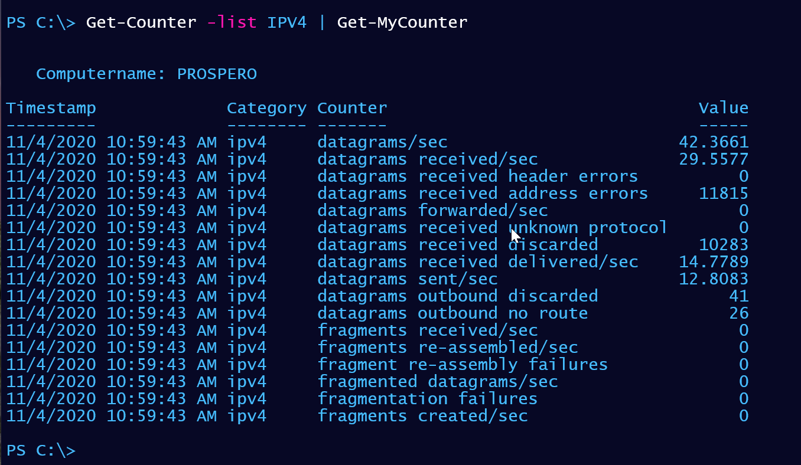

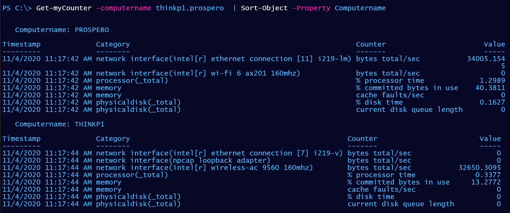

One advantage of `Get-MyCounter` over `Get-Counter` is that the performance data is easier to work with.

```powershell
 Get-MyCounter '\IPv4\datagrams/sec' -MaxSamples 60 -SampleInterval 5 -computer SRV1 | Export-CSV  c:\work\srv1_ipperf.csv -NoTypeInformation
 ```

In this example, the performance counter is sampled 60 times every 5 seconds and the data is exported to a CSV file which could easily be opened in Microsoft Excel. Here's a sample of the output object.

```dos
Computername : SRV1
Category     : ipv4
Counter      : datagrams/sec
Instance     :
Value        : 66.0818918347238
Timestamp    : 11/4/2020 11:31:29 AM
```

`Get-MyCounter` writes a custom object to the pipeline which has an associated formatting file with custom views.

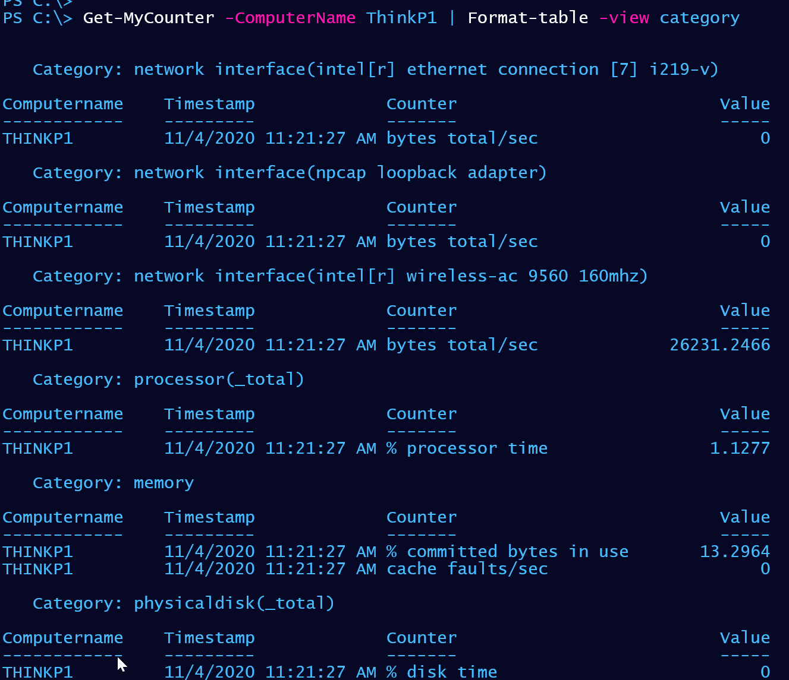

### [Get-DirectoryInfo](docs/Get-DirectoryInfo.md)

This command, which has an alias of *dw*, is designed to provide quick access to top-level directory information. The default behavior is to show the total number of files in the immediate directory. Although the command will also capture the total file size in the immediate directory. You can use the Depth parameter to recurse through a specified number of levels. The default displays use ANSI escape sequences.


The command output will use a wide format by default. However, other wide views are available.

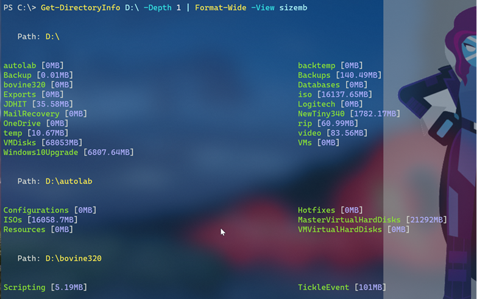

You can use the object in other ways.

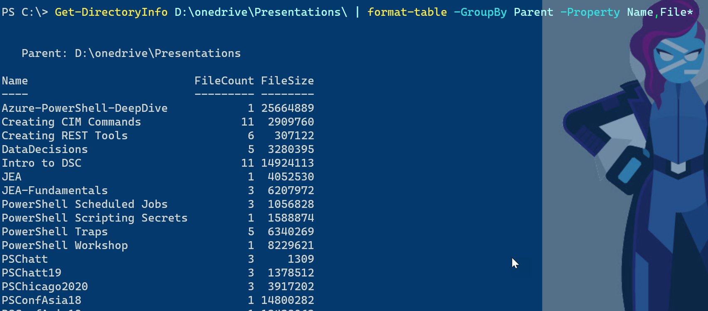

### [Get-FormatView](docs/Get-FormatView.md)

PowerShell's formatting system includes a number of custom views that display objects in different ways. Unfortunately, this information is not readily available to a typical PowerShell user. This command displays the available views for a given object type.

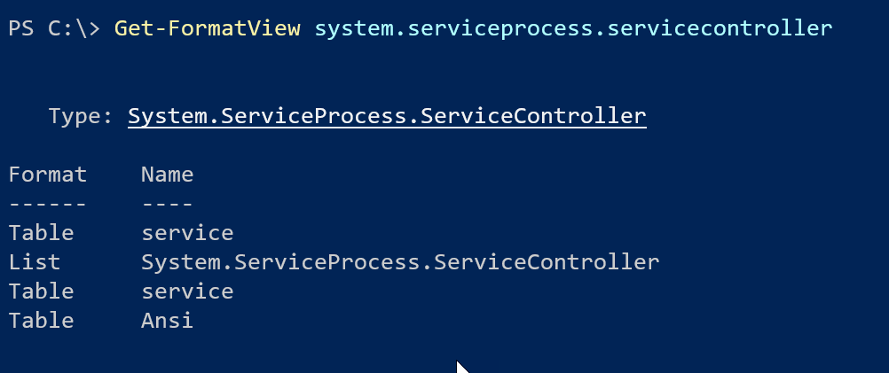

This command has an alias of `gfv`.

### [Copy-PSFunction](docs/Copy-PSFunction.md)

This command is designed to solve the problem when you want to run a function loaded locally on a remote computer. Copy-PSFunction will copy a PowerShell function that is loaded in your current PowerShell session to a remote PowerShell session. The remote session must already be created. The copied function only exists remotely for the duration of the remote PowerShell session.

```powershell
$s = new-pssession -ComputerName win10 -cred $art
Copy-PSFunction Get-Status -Session $s
```

Once copied, you might use `Invoke-Command` to run it.

```powershell
Invoke-Command { get-status -asstring } -session $s
```

If the function relies on external or additional files, you will have to copy them to the remote session separately.

### [Get-PSProfile](docs/Get-PSProfile.md)

This command is designed for Windows systems and make it easy to identify all possible PowerShell profile scripts. Including those for hosts such as VSCode or the PowerShell ISE. The command writes a custom object to the pipeline which has defined formatting. The default view is a table.

```dos
PS C:\> get-psprofile


   Name: PowerShell

Scope                  Path                                                                Exists
-----                  ----                                                                ------
AllUsersCurrentHost    C:\Program Files\PowerShell\7\Microsoft.PowerShell_profile.ps1      False
AllUsersAllHosts       C:\Program Files\PowerShell\7\profile.ps1                           False
CurrentUserAllHosts    C:\Users\Jeff\Documents\PowerShell\profile.ps1                      True
CurrentUserCurrentHost C:\Users\Jeff\Documents\PowerShell\Microsoft.PowerShell_profile.ps1 True


   Name: Windows PowerShell

Scope                  Path                                                                        Exists
-----                  ----                                                                        ------
AllUsersCurrentHost    C:\WINDOWS\System32\WindowsPowerShell\v1.0\Microsoft.PowerShell_profile.ps1 True
AllUsersAllHosts       C:\WINDOWS\System32\WindowsPowerShell\v1.0\profile.ps1                      True
CurrentUserAllHosts    C:\Users\Jeff\Documents\WindowsPowerShell\profile.ps1                       True
CurrentUserCurrentHost C:\Users\Jeff\Documents\WindowsPowerShell\Microsoft.PowerShell_profile.ps1  True
```

There is also a list view.

```dos
PS C:\> get-psprofile | Where-Object {$_.name -eq 'powershell'} | Format-List


   Name: PowerShell


Scope        : AllUsersCurrentHost
Path         : C:\Program Files\PowerShell\7\Microsoft.PowerShell_profile.ps1
Exists       : False
LastModified :

Scope        : AllUsersAllHosts
Path         : C:\Program Files\PowerShell\7\profile.ps1
Exists       : False
LastModified :

Scope        : CurrentUserAllHosts
Path         : C:\Users\Jeff\Documents\PowerShell\profile.ps1
Exists       : True
LastModified : 9/9/2020 2:35:45 PM

Scope        : CurrentUserCurrentHost
Path         : C:\Users\Jeff\Documents\PowerShell\Microsoft.PowerShell_profile.ps1
Exists       : True
LastModified : 9/9/2020 2:03:44 PM
```

### [Get-MyAlias](docs/Get-MyAlias.md)

Often you might define aliases for functions and scripts you use all of the time. It may difficult sometimes to remember them all or to find them in the default `Get-Alias` output. This command will list all currently defined aliases that are not part of the initial PowerShell state.

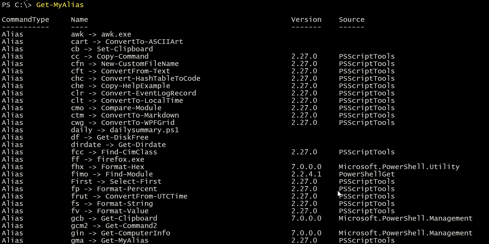

These are all aliases defined in the current session that aren't part of the initial session state. You can filter aliases to make it easier to find those that aren't defined in a module. These aliases should be ones created in your stand-alone scripts or PowerShell profile.


The PSScriptTools module also includes a custom formatting file for alias objects which you can use with `Get-Alias` or `Get-MyAlias`.

```powershell
Get-Alias | Sort-Object Source | Format-Table -View source
```

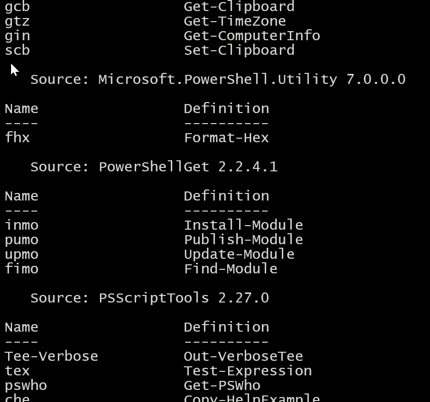

This command has an alias of `gma`.

### [Get-ModuleCommand](docs/Get-ModuleCommand.md)

This is an alternative to `Get-Command` to make it easier to see at a glance what commands are contained within a module and what they can do. By default, `Get-ModuleCommand` looks for loaded modules. Use `-ListAvailable` to see commands in the module not currently loaded. Note that if the help file is malformed or missing, you might get oddly formatted results.

```dos
PS C:\> Get-ModuleCommand PSCalendar


       Verb: Get

  Name                           Alias           Type      Synopsis
  ----                           -----           ----      --------
  Get-Calendar                   cal             Function  Displays a visua...


      Verb: Show

  Name                           Alias           Type      Synopsis
  ----                           -----           ----      --------
  Show-Calendar                  scal            Function  Display a color...
  Show-GuiCalendar               gcal            Function  Display a WPF-b...
```

Get module commands using the default formatted view. There is also a default view for `Format-List`.

### [Get-PSScriptTools](docs/Get-PSScriptTools.md)

You can use this command to get a summary list of functions in this module.

```dos

PS C:\> Get-PSScriptTools


   Verb: Add

Name             Alias                Synopsis
----             -----                --------
Add-Border                            Create a text border around a string.


   Verb: Compare

Name            Alias                Synopsis
----            -----                --------
Compare-Module  cmo                  Compare PowerShell module versions.

...
```

Here's another way you could use this command to list functions with defined aliases in the PSScriptTools module.

```dos
PS C:\> Get-PSScriptTools | Where-Object alias |
Select-Object Name,alias,Synopsis

Name                   Alias Synopsis
----                   ----- --------
Compare-Module         cmo   Compare PowerShell module versions.
Convert-EventLogRecord clr   Convert EventLogRecords to structured objects
ConvertFrom-Text       cft   Convert structured text to objects.
ConvertFrom-UTCTime    frut  Convert a datetime value from universal
ConvertTo-LocalTime    clt   Convert a foreign time to local
...
```

### [Convert-EventLogRecord](docs/Convert-EventLogRecord.md)

When you use [Get-WinEvent](https://docs.microsoft.com/en-us/powershell/module/microsoft.powershell.diagnostics/get-winevent?view=powershell-7&WT.mc_id=ps-gethelp), the results are objects you can work with in PowerShell. However, often times there is additional information that is part of the eventlog record, such as replacement strings, that are used to construct a message. This additional information is not readily exposed. You can use this command to convert the results of a `Get-WinEvent` command into a PowerShell custom object with additional information.

```dos
PS C:\> Get-WinEvent -FilterHashtable @{Logname='System';ID=7045} -MaxEvents 1|
Convert-EventLogRecord


LogName      : System
RecordType   : Information
TimeCreated  : 1/21/2020 3:49:46 PM
ID           : 7045
ServiceName  : Netwrix Account Lockout Examiner
ImagePath    : "C:\Program Files (x86)\Netwrix\Account Lockout Examiner
              \ALEService.exe"
ServiceType  : user mode service
StartType    : auto start
AccountName  : bovine320\jeff
Message      : A service was installed in the system.

               Service Name:  Netwrix Account Lockout Examiner
               Service File Name:  "C:\Program Files (x86)\Netwrix\Account
               Lockout Examiner\ALEService.exe"
               Service Type:  user mode service
               Service Start Type:  auto start
               Service Account:  bovine320\jeff
Keywords     : {Classic}
Source       : Service Control Manager
Computername : Bovine320
```

### [Get-WhoIs](docs/Get-WhoIs.md)

This command will retrieve WhoIs information from the ARIN database for a given IPv4 address.

```dos
PS C:\> Get-WhoIs 208.67.222.222 | Select-Object -Property *

IP                     : 208.67.222.222
Name                   : OPENDNS-NET-1
RegisteredOrganization : Cisco OpenDNS, LLC
City                   : San Francisco
StartAddress           : 208.67.216.0
EndAddress             : 208.67.223.255
NetBlocks              : 208.67.216.0/21
Updated                : 3/2/2012 8:03:18 AM

PS C:\> '1.1.1.1','8.8.8.8','208.67.222.222'| Get-WhoIs | Format-List

IP                     : 1.1.1.1
Name                   : APNIC-1
RegisteredOrganization : Asia Pacific Network Information Centre
City                   : South Brisbane
StartAddress           : 1.0.0.0
EndAddress             : 1.255.255.255
NetBlocks              : 1.0.0.0/8
Updated                : 7/30/2010 9:23:43 AM

IP                     : 8.8.8.8
Name                   : LVLT-GOGL-8-8-8
RegisteredOrganization : Google LLC
City                   : Mountain View
StartAddress           : 8.8.8.0
EndAddress             : 8.8.8.255
NetBlocks              : 8.8.8.0/24
Updated                : 3/14/2014 4:52:05 PM

IP                     : 208.67.222.222
Name                   : OPENDNS-NET-1
RegisteredOrganization : Cisco OpenDNS, LLC
City                   : San Francisco
StartAddress           : 208.67.216.0
EndAddress             : 208.67.223.255
NetBlocks              : 208.67.216.0/21
Updated                : 3/2/2012 8:03:18 AM
```

This module includes a custom format file for these results.

### [Compare-Module](docs/Compare-Module.md)

Use this command to compare module versions between what is installed against an online repository like the PSGallery

```dos
PS C:\> Compare-Module Platyps


Name             : platyPS
OnlineVersion    : 0.14.0
InstalledVersion : 0.14.0,0.12.0,0.11.1,0.10.2,0.9.0
PublishedDate    : 4/3/2019 12:46:30 AM
UpdateNeeded     : False
```

Or you can compare and manage multiple modules.

```powershell
Compare-Module | Where UpdateNeeded |
Out-Gridview -title "Select modules to update" -outputMode multiple |
Foreach { Update-Module $_.name }
```

This example compares modules and sends the results to `Out-Gridview`. Use `Out-Gridview` as an object picker to decide what modules to update.

### [Get-WindowsVersion](docs/Get-WindowsVersion.md)

This is a PowerShell version of the `winver.exe` utility. This command uses PowerShell remoting to query the registry on a remote machine to retrieve Windows version information.

```powershell
Get-WindowsVersion -Computername win10,srv1,srv2 -Credential company\artd
```

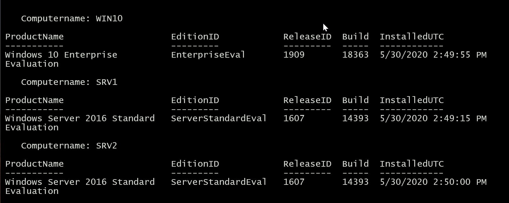

The output has a default table view but there are other properties you might want to use.

```dos
PS C:\> Get-WindowsVersion | Select-Object *


ProductName  : Windows 10 Pro
EditionID    : Professional
ReleaseID    : 2009
Build        : 19042.906
Branch       : vb_release
InstalledUTC : 10/16/2020 3:09:01 PM
Computername : PROSPERO
```

#### [Get-WindowsVersionString](docs/Get-WindowsVersionString.md)

This command is a variation of `Get-WindowsVersion` that returns a formatted string with version information.

```dos
PS C:\> Get-WindowsVersionString
PROSPERO Windows 10 Pro Version Professional (OS Build 19042.906)
```

### [New-PSDriveHere](docs/New-PSDriveHere.md)

This function will create a new PSDrive at the specified location. The default is the current location, but you can specify any PSPath. by default, the function will take the last word of the path and use it as the name of the new PSDrive.

```dos
PS C:\users\jeff\documents\Enterprise Mgmt Webinar> new-psdrivehere -setlocation
PS Webinar:\>
```

You can use the first word in the leaf location or specify something completely different.

```PowerShell
New-PSDrivehere \\ds416\backup\ Backup
```

### [Get-MyVariable](docs/Get-MyVariable.md)

This function will return all variables not defined by PowerShell or by this function itself. The default is to return all user-created variables from the global scope, but you can also specify a scope such as `script`, `local`, or a number 0 through 5.

```dos
PS C:\> Get-MyVariable

NName Value                  Type
---- -----                  ----
a    bits                   ServiceController
dt   10/22/2020 10:49:38 AM DateTime
foo  123                    Int32
r    {1, 2, 3, 4...}        Object[]
...
```

Depending on the value and how PowerShell chooses to display it, you may not see the type.

### [ConvertFrom-Text](docs/ConvertFrom-Text.md)

This command can be used to convert text from a file or a command-line tool into objects. It uses a regular expression pattern with named captures and turns the result into a custom object. You have the option of specifying a typename in case you are using custom format files.

```dos
PS C:\> $arp = '(?<IPAddress>(\d{1,3}\.){3}\d{1,3})\s+(?<MAC>(\w{2}-){5}\w{2})\s+(?<Type>\w+$)'
PS C:\> arp -g -N 172.16.10.22 | Select-Object -skip 3 |
foreach {$_.Trim()} | ConvertFrom-Text $arp -TypeName arpData -NoProgress

IPAddress          MAC                        Type
---------          ---                        ----
172.16.10.1        b6-fb-e4-16-41-be       dynamic
172.16.10.100      00-11-32-58-7b-10       dynamic
172.16.10.115      5c-aa-fd-0c-bf-fa       dynamic
172.16.10.120      5c-1d-d9-58-81-51       dynamic
172.16.10.159      3c-e1-a1-17-6d-0a       dynamic
172.16.10.162      00-0e-58-ce-8b-b6       dynamic
172.16.10.178      00-0e-58-8c-13-ac       dynamic
172.16.10.185      d0-04-01-26-b5-61       dynamic
172.16.10.186      e8-b2-ac-95-92-98       dynamic
172.16.10.197      fc-77-74-9f-f4-2f       dynamic
172.16.10.211      14-20-5e-93-42-fb       dynamic
172.16.10.222      28-39-5e-3b-04-33       dynamic
172.16.10.226      00-0e-58-e9-49-c0       dynamic
172.16.10.227      48-88-ca-e1-a6-00       dynamic
172.16.10.239      5c-aa-fd-83-f1-a4       dynamic
172.16.255.255     ff-ff-ff-ff-ff-ff        static
224.0.0.2          01-00-5e-00-00-02        static
224.0.0.7          01-00-5e-00-00-07        static
224.0.0.22         01-00-5e-00-00-16        static
224.0.0.251        01-00-5e-00-00-fb        static
224.0.0.252        01-00-5e-00-00-fc        static
239.255.255.250    01-00-5e-7f-ff-fa        static
```

This example uses a previously created and import format.ps1xml file for the custom type name.

### [Get-PSWho](docs/Get-PSWho.md)

This command will provide a summary of relevant information for the current user in a PowerShell Session. You might use this to troubleshoot an end-user problem running a script or command.

```dos
PS C:\> Get-PSWho

User            : BOVINE320\Jeff
Elevated        : True
Computername    : BOVINE320
OperatingSystem : Microsoft Windows 10 Pro [64-bit]
OSVersion       : 10.0.18363
PSVersion       : 5.1.18362.145
Edition         : Desktop
PSHost          : ConsoleHost
WSMan           : 3.0
ExecutionPolicy : RemoteSigned
Culture         : English (United States)
```

You can also turn this into a text block using the `AsString` parameter. This is helpful when you want to include the output in some type of report.


### [Find-CimClass](docs/Find-CimClass.md)

This function is designed to search an entire CIM repository for a class name. Sometimes, you may have a guess about a class name but not know the full name or even the correct namespace. `Find-CimClass` will recursively search for a given classname. You can use wildcards and search remote computers.


### [Out-VerboseTee](docs/Out-VerboseTee.md)

This command is intended to let you see your verbose output and write the verbose messages to a log file. It will only work if the verbose pipeline is enabled, usually when your command is run with -Verbose. This function is designed to be used within your scripts and functions. You either have to hard code a file name or find some other way to define it in your function or control script. You could pass a value as a parameter or set it as a `PSDefaultParameterValue`.

This command has aliases of `Tee-Verbose` and `tv`.

```powershell
Begin {
    $log = New-RandomFilename -useTemp -extension log
    Write-Detail "Starting $($myinvocation.mycommand)" -Prefix begin |
    Tee-Verbose $log
    Write-Detail "Logging verbose output to $log" -prefix begin |
    Tee-Verbose -append
    Write-Detail "Initializing data array" -Prefix begin |
    Tee-Verbose $log -append
    $data = @()
} #begin
```

When the command is run with -Verbose you will see the verbose output **and** it will be saved to the specified log file.

### [Remove-Runspace](docs/Remove-Runspace.md)

During the course of your PowerShell work, you may discover that some commands and scripts can leave behind runspaces such as `ConvertTo-WPFGrid`. You may even deliberately be creating additional runspaces. These runspaces will remain until you exit your PowerShell session. Or use this command to cleanly close and dispose of runspaces.

```powershell
Get-RunSpace | where ID -gt 1 | Remove-RunSpace
```

Get all runspaces with an ID greater than 1, which is typically your current session, and remove the runspace.

### [Get-PSLocation](docs/Get-PSLocation.md)

A simple function to get common locations. This can be useful with cross-platform scripting.


### [Get-PowerShellEngine](docs/Get-PowerShellEngine.md)

Use this command to quickly get the path to the PowerShell executable. In Windows, you should get a result like this:

```dos
PS C:\> Get-PowerShellEngine
C:\Windows\System32\WindowsPowerShell\v1.0\powershell.exe
```

But PowerShell on non-Windows platforms is a bit different:

```dos
PS /home/jhicks> Get-PowerShellEngine
/opt/microsoft/powershell/7/pwsh
```

You can also get detailed information.

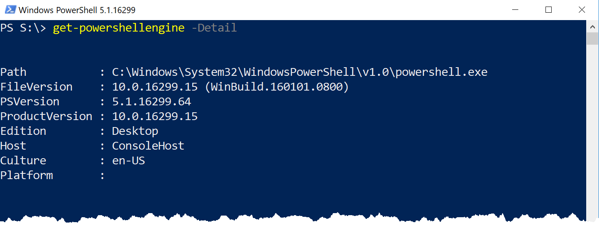


Results will vary depending on whether you are running PowerShell on Windows nor non-Windows systems.

### [Get-PathVariable](docs/Get-PathVariable.md)

Over time, as you add and remove programs, your `%PATH%` might change. An application may add a location but not remove it when you uninstall the application. This command makes it easier to identify locations and whether they are still good.

```dos
PS C:\> Get-PathVariable

Scope   UserName Path                                                    Exists
-----   -------- ----                                                    ------
User    Jeff     C:\Program Files\kdiff3                                   True
User    Jeff     C:\Program Files (x86)\Bitvise SSH Client                 True
User    Jeff     C:\Program Files\OpenSSH                                  True
User    Jeff     C:\Program Files\Intel\WiFi\bin\                          True
User    Jeff     C:\Program Files\Common Files\Intel\WirelessCommon\       True
User    Jeff     C:\Users\Jeff\AppData\Local\Programs\Microsoft VS Co...   True
User    Jeff     C:\Program Files (x86)\Vale\                              True
...
```

## File Tools

### [Get-LastModifiedFile](docs/Get-LastModifiedFile.md)

Get files last modified within a certain interval. The default is 24 hours.

```dos
PS C:\> Get-LastModifiedFile -Path c:\work

    Directory: C:\work

Mode                 LastWriteTime         Length Name
----                 -------------         ------ ----
-a---          11/30/2021  1:52 PM           2010 a.txt
-a---          11/30/2021  1:52 PM           5640 b.txt
```

But you can specify other ranges.

```dos
PS C:\> Get-LastModifiedFile -Path c:\scripts -filter *.xml -Interval Months -IntervalCount 6

    Directory: C:\Scripts

Mode                 LastWriteTime         Length Name
----                 -------------         ------ ----
-a---           8/31/2021  7:12 PM          17580 DefaultDomainPolicy.xml
-a---           8/31/2021  7:12 PM          17290 PKIAutoEnroll.xml
-a---           8/31/2021  8:43 PM           9786 sample-gpo.xml
-a---           8/31/2021  7:24 PM          50062 TestUser.xml
-a---           6/22/2021  7:47 PM           4628 vaults.xml
```

You might use this command with other PowerShell commands to get usage statistics.

```dos
PS C:\> Get-LastModifiedFile -Path c:\scripts -Recurse -Interval Years -IntervalCount 1 |
>> Group-Object {$_.LastWriteTime.month} |
>> Select-Object @{Name="Month";Expression = {"{0:MMM}" -f (Get-Date -Month $_.Name)}},
>> Count

Month Count
----- -----
Jan     152
Feb     200
Mar     228
Apr     169
May     106
Jun      92
Jul      86
Aug     112
Sep     109
Oct     136
Nov     225
Dec     216
```

### [Get-FileExtensionInfo](docs/Get-FileExtensionInfo.md)

This command will search a given directory and produce a report of all files based on their file extension. This command is only available in PowerShell 7. The extension with the largest total size will be highlighted in color.

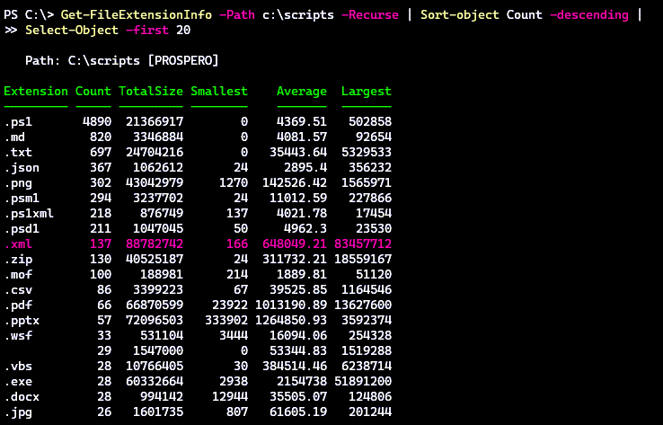

### [Test-EmptyFolder](docs/Test-EmptyFolder.md)

This command will test if a given folder path is empty of all files anywhere in the path. This includes hidden files. The command will return True even if there are empty sub-folders. The default output is True or False but you can use -Passthru to get more information.

```dos
PS C:\> Get-ChildItem c:\work -Directory | Test-EmptyFolder -passthru |
Where-Object {$_.IsEmpty} |
Foreach-Object { Remove-Item -LiteralPath $_.path -Recurse -force -whatif}

What if: Performing the operation "Remove Directory" on target "C:\work\demo3".
What if: Performing the operation "Remove Directory" on target "C:\work\installers".
What if: Performing the operation "Remove Directory" on target "C:\work\new".
What if: Performing the operation "Remove Directory" on target "C:\work\sqlback".
What if: Performing the operation "Remove Directory" on target "C:\work\todd".
What if: Performing the operation "Remove Directory" on target "C:\work\[data]".
```

Find all empty sub-folders under C:\Work and pipe them to `Remove-Item`. This is one way to remove empty folders. The example is piping objects to `ForEach-Object` so that `Remove-Item` can use the -LiteralPath parameter, because `C:\work\[data]` is a non-standard path.

### [Get-FolderSizeInfo](docs/Get-FolderSizeInfo.md)

Use this command to quickly get the size of a folder. You also have an option to include hidden files. The command will measure all files in all subdirectories.

```dos
PS C:\> Get-FolderSizeInfo c:\work

Computername    Path                        TotalFiles     TotalSize
------------    ----                        ----------     ---------
BOVINE320       C:\work                            931     137311146


PS C:\> Get-FolderSizeInfo c:\work -Hidden

Computername    Path                         TotalFiles     TotalSize
------------    ----                         ----------     ---------
BOVINE320       C:\work                            1375     137516856
```

The command includes a format file with an additional view to display the total size in KB, MB, GB, or TB.

```dos
PS C:\> Get-ChildItem D:\ -Directory | Get-FolderSizeInfo -Hidden |
Where-Object TotalSize -gt 1gb | Sort-Object TotalSize -Descending |
Format-Table -View gb

Computername    Path                               TotalFiles   TotalSizeGB
------------    ----                              ----------   -----------
BOVINE320       D:\Autolab                               159      137.7192
BOVINE320       D:\VMDisks                                18      112.1814
BOVINE320       D:\ISO                                    17       41.5301
BOVINE320       D:\FileHistory                        104541       36.9938
BOVINE320       D:\Vagrant                                13       19.5664
BOVINE320       D:\Vms                                    83        5.1007
BOVINE320       D:\2016                                 1130        4.9531
BOVINE320       D:\video                                 125         2.592
BOVINE320       D:\blog                                21804        1.1347
BOVINE320       D:\pstranscripts                      122092        1.0914
```

Or you can use the `name` view.

```dos
PS C:\> Get-ChildItem c:\work -Directory | Get-FolderSizeInfo -Hidden |
Where-Object {$_.totalsize -ge 2mb} | Format-Table -view name


   Path: C:\work

Name                    TotalFiles      TotalKB
----                    ----------      -------
A                               20    5843.9951
keepass                         15     5839.084
PowerShellBooks                 26    4240.3779
sunday                          47   24540.6523
```

### [Optimize-Text](docs/Optimize-Text.md)

Use this command to clean and optimize content from text files. Sometimes text files have blank lines, or the content has trailing spaces. These sorts of issues can cause problems when passing the content to other commands.

This command will strip out any lines that are blank or have nothing by white space, and trim leading and trailing spaces. The optimized text is then written back to the pipeline. Optionally, you can specify a property name. This can be useful when your text file is a list of computer names and you want to take advantage of pipeline binding.

### [Get-FileItem](docs/Get-FileItem.md)

A PowerShell version of the CLI `where.exe` command. You can search with a simple or regex pattern.

```dos
PS C:\> pswhere winword.exe -Path c:\ -Recurse -first

C:\Program Files\Microsoft Office\root\Office16\WINWORD.EXE
```

Note that you might see errors for directories where you don't have access permission. This is normal.

### [New-CustomFileName](docs/New-CustomFileName.md)

This command will generate a custom file name based on a template string that you provide.

```dos
PS C:\> New-CustomFileName %computername_%day%monthname%yr-%time.log
COWPC_28Nov19-142138.log

PS C:\> New-CustomFileName %dayofweek-%####.dat
Tuesday-3128.dat
```

You can create a template string using any of these variables. Most of these should be self-explanatory.

+ %username
+ %computername
+ %year  - 4 digit year
+ %yr  - 2 digit year
+ %monthname - The abbreviated month name
+ %month  - The month number
+ %dayofweek - The full name of the week day
+ %day
+ %hour
+ %minute
+ %time
+ %string - A random string
+ %guid

You can also insert a random number using `%` followed by a `#` character for each digit you want.

```dos
22 = %##
654321 = %######
```

### [New-RandomFilename](docs/New-RandomFilename.md)

Create a new random file name. The default is a completely random name, including the extension.

```dos
PS C:\> New-RandomFilename
fykxecvh.ipw
```

But you can specify an extension.

```dos
PS C:\> New-RandomFilename -extension dat
emevgq3r.dat
```

Optionally you can create a random file name using the TEMP folder or your HOME folder. On Windows platforms, this will default to your Documents folder.

```dos
PS C:\> New-RandomFilename -extension log -UseHomeFolder
C:\Users\Jeff\Documents\kbyw4fda.log
```

On Linux machines, it will be the home folder.

```dos
PS /mnt/c/scripts> New-RandomFilename -home -Extension tmp
/home/jhicks/oces0epq.tmp
```

### [ConvertTo-Markdown](docs/ConvertTo-Markdown.md)

This command is designed to accept pipelined output and create a markdown document. The pipeline output will formatted as a text block or a table You can optionally define a title, content to appear before the output and content to appear after the output. You can run a command like this:

```powershell
Get-Service Bits,Winrm |
Convertto-Markdown -title "Service Check" -precontent "## $($env:computername)"
-postcontent "_report $(Get-Date)_"
 ```

which generates this markdown:

```markdown
    # Service Check

    ## THINKX1

    ```dos

    Status   Name               DisplayName
    ------   ----               -----------
    Running  Bits               Background Intelligent Transfer Ser...
    Running  Winrm              Windows Remote Management (WS-Manag...
    ```

    _report 09/25/2021 09:57:12_
```

You also have the option to format the output as a markdown table.

```powershell
ConvertTo-Markdown -title "OS Summary" -PreContent "## $($env:computername)" -postcontent "_Confidential_" -AsTable
```

Which creates this markdown output.

```markdown
# OS Summary

## THINKX1-JH

| ProductName | EditionID | ReleaseID | Build | Branch | InstalledUTC | Computername |
| ----------- | --------- | --------- | ----- | ------ | ------------ | ------------ |
| Windows 10 Pro | Professional | 2009 | 22000.376 | co_release | 08/10/2021 00:17:07 | THINKX1-JH |

_Confidential_
```


Or you can create a list table with the property name in one columen and the value in the second column.

```powershell
Get-WindowsVersion | ConvertTo-Markdown -title "OS Summary" -PreContent "## $($env:computername)" -postcontent "_Confidential_" -AsList
```

```markdown
# OS Summary

## THINKX1-JH

|    |    |
|----|----|
|ProductName|Windows 10 Pro|
|EditionID|Professional|
|ReleaseID|2009|
|Build|22000.376|
|Branch|co_release|
|InstalledUTC|8/10/2021 12:17:07 AM|
|Computername|THINKX1-JH|

_Confidential_
```

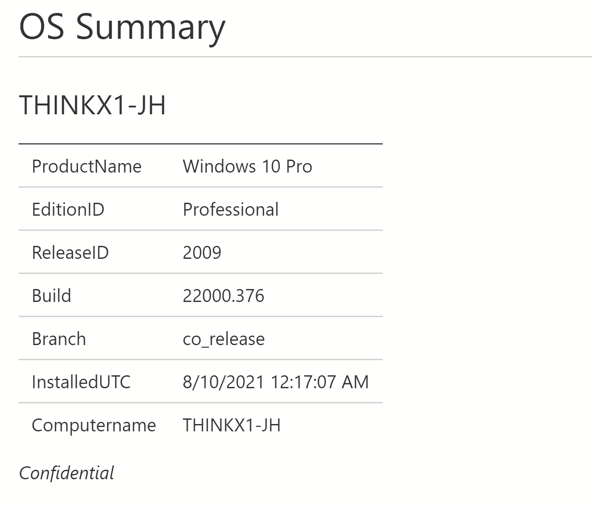

Because the function writes markdown to the pipeline you will need to pipe it to a command `Out-File` to create a file.

## Editor Integrations

Because this module is intended to make scripting easier for you, it adds a few editor specific features if you import this module in either the PowerShell ISE or Visual Studio Code. The VS Code features assume you are using the integrated PowerShell terminal.

### Insert ToDo

One such feature is the ability to insert ToDo statements into PowerShell files. If you are using the PowerShell ISE or VS Code and import this module, it will add the capability to insert a line like this:

```dos
    # [12/13/2020 16:52:40] TODO: Add parameters
```

In the PowerShell ISE, you will get a new menu under Add-Ons.


You can use the menu or keyboard shortcut which will launch an input box.


The comment will be inserted at the current cursor location.

In VS Code, access the command palette (Ctrl+Shift+P) and then `PowerShell: Show Additional Commands from PowerShell Modules`. Select `Insert ToDo` from the list, and you'll get the same input box. Note that this will only work for PowerShell files.

### Set Terminal Location

Another feature is the ability to set your terminal location to match that of the the currently active file. For example, if the current file is located in C:\Scripts\Foo and your terminal location is D:\Temp\ABC, you can quickly jump to the file location.

```dos
PS D:\Temp\ABC\> sd
PS C:\Scripts\Foo\>
```

The full command name is `Set-LocationToFile` but you'll find it easier to use the `sd` or `jmp` aliases. This command will also clear the host.

## Graphical Tools

### [Invoke-InputBox](docs/Invoke-InputBox.md)

This function is a graphical replacement for `Read-Host`. It creates a simple WPF form that you can use to get user input. The value of the text box will be written to the pipeline.

```powershell
$name = Invoke-InputBox -Prompt "Enter a user name" -Title "New User Setup"
```

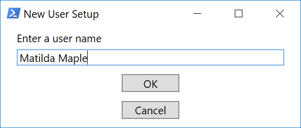

You can also capture a secure string.

```powershell
Invoke-Inputbox -Prompt "Enter a password for $Name" -AsSecureString
 -BackgroundColor red
```


This example also demonstrates that you can change the form's background color. This function will **not** work in PowerShell Core.

### [New-WPFMessageBox](docs/New-WPFMessageBox.md)

This function creates a Windows Presentation Foundation (WPF) based message box. This is intended to replace the legacy MsgBox function from VBScript and the Windows Forms library. The command uses a set of predefined button sets, each of which will close the form and write a value to the pipeline.

+ OK     = 1
+ Cancel = 0
+ Yes    = $True
+ No     = $False

You can also create an ordered hashtable of your own buttons and values. It is assumed you will typically use this function in a script where you can capture the output and take some action based on the value.

```powershell
New-WPFMessageBox -Message "Are you sure you want to do this?"
-Title Confirm -Icon Question -ButtonSet YesNo
```

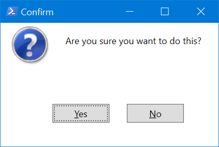

You can also create your own custom button set as well as modify the background color.

```powershell
New-WPFMessageBox -Message "Select a system option from these choices:"
-Title "You Decide" -Background cornsilk -Icon Warning
-CustomButtonSet ([ordered]@{"Reboot"=1;"Shutdown"=2;"Cancel"=3})
```

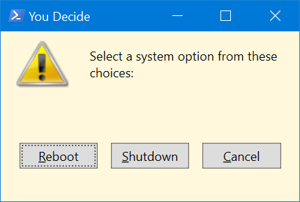

### [ConvertTo-WPFGrid](docs/ConvertTo-WPFGrid.md)

This command is an alternative to `Out-Gridview`. It works much the same way. Run a PowerShell command and pipe it to this command. The output will be displayed in an auto-sized data grid. You can click on column headings to sort. You can resize columns and you can re-order columns.

```powershell
Get-Eventlog -list -ComputerName DOM1,SRV1,SRV2 |
Select Machinename,Log,MaximumKilobytes,Overflowaction,
@{Name="RetentionDays";Expression={$_.MinimumRetentionDays}},
@{Name="Entries";Expression = {$_.entries.count}} |
ConvertTo-WPFGrid -Title "Event Log Report"
```


You can also have automatically refresh the data.

```powershell
Get-Process | Sort-Object WS -Descending |
Select-Object -first 20 ID,Name,WS,VM,PM,Handles,StartTime |
ConvertTo-WPFGrid -Refresh -timeout 20 -Title "Top Processes"
```


Note that in v2.4.0 the form layout was modified and may not be reflected in these screen shots.

## Hashtable Tools

### [Convert-CommandToHashtable](docs/Convert-CommandToHashtable.md)

This command is intended to convert a long PowerShell expression with named parameters into a splatting alternative.

```dos
PS C:\> Convert-CommandToHashtable -Text "get-eventlog -listlog
-computername a,b,c,d -erroraction stop"

$paramHash = @{
  listlog = $True
   computername = "a","b","c","d"
   erroraction = "stop"
}

Get-EventLog @paramHash
```

The idea is that you can copy the output of the command into a script file.

### [Convert-HashtableString](docs/Convert-HashtableString.md)

This function is similar to `Import-PowerShellDataFile`. But where that command can only process a file, this command will take any hashtable-formatted string and convert it into an actual hashtable.

```dos
PS C:\> Get-Content c:\work\test.psd1 | Unprotect-CMSMessage |
Convert-HashtableString

Name                           Value
----                           -----
CreatedBy                      BOVINE320\Jeff
CreatedAt                      10/02/2020 21:28:47 UTC
Computername                   Think51
Error
Completed                      True
Date                           10/02/2020 21:29:35 UTC
Scriptblock                    restart-service spooler -force
CreatedOn                      BOVINE320
```

The test.psd1 file is protected as a CMS Message. In this example, the contents are decoded as a string which is then in turn converted into an actual hashtable.

### [Convert-HashtableToCode](docs/Convert-HashtableToCode.md)

Use this command to convert a hashtable into its text or string equivalent.

```dos
PS C:\> $h = @{Name="SRV1";Asset=123454;Location="Omaha"}
PS C:\> Convert-HashtableToCode $h
@{
        Name = 'SRV1'
        Asset = 123454
        Location = 'Omaha'
}
```

Convert a hashtable object to a string equivalent that you can copy into your script.

### [ConvertTo-Hashtable](docs/ConvertTo-Hashtable.md)

This command will take an object and create a hashtable based on its properties. You can have the hashtable exclude some properties as well as properties that have no value.

```dos
PS C:\> Get-Process -id $pid | Select-Object name,id,handles,workingset |
ConvertTo-Hashtable

Name                           Value
----                           -----
WorkingSet                     418377728
Name                           powershell_ise
Id                             3456
Handles                        958
```

### [Join-Hashtable](docs/Join-Hashtable.md)

This command will combine two hashtables into a single hashtable.Join-Hashtable will test for duplicate keys. If any of the keys from the first, or primary hashtable are found in the secondary hashtable, you will be prompted for which to keep. Or you can use -Force which will always keep the conflicting key from the first hashtable.

```dos
PS C:\> $a=@{Name="Jeff";Count=3;Color="Green"}
PS C:\> $b=@{Computer="HAL";Enabled=$True;Year=2020;Color="Red"}
PS C:\> Join-Hashtable $a $b
Duplicate key Color
A Green
B Red
Which key do you want to KEEP \[AB\]?: A

Name                           Value
----                           -----
Year                           2020
Name                           Jeff
Enabled                        True
Color                          Green
Computer                       HAL
Count                          3
```

### [Rename-Hashtable](docs/Rename-Hashtable.md)

This command allows you to rename a key in an existing hashtable or ordered dictionary object.

```dos
PS C:\> $h = Get-Service Spooler | ConvertTo-Hashtable
```

The hashtable in $h has Machinename property which can be renamed.

```dos
PS C:\> Rename-Hashtable -Name h -Key Machinename -NewKey Computername
-Passthru

Name                           Value
----                           -----
ServiceType                    Win32OwnProcess, InteractiveProcess
ServiceName                    Spooler
Container
CanPauseAndContinue            False
RequiredServices               {RPCSS, http}
ServicesDependedOn             {RPCSS, http}
Computername                   .
CanStop                        True
StartType                      Automatic
Site
ServiceHandle                  SafeServiceHandle
DisplayName                    Print Spooler
CanShutdown                    False
Status                         Running
Name                           Spooler
DependentServices              {Fax}
```

## Select Functions

The module contains several functions that simplify the use of `Select-Object` or `Select-Object` in conjunction with `Where-Object`. The commands are intended to make it easier to select objects in a pipelined expression. The commands include features so that you can sort the incoming objects on a given property first.

### [Select-First](docs/Select-First.md)

Normally, you might run a command with `Select-Object` like this:

```powershell
Get-Process | Select-Object -first 5 -Property WS -Descending

Handles  NPM(K)    PM(K)      WS(K)     CPU(s)     Id  SI ProcessName
-------  ------    -----      -----     ------     --  -- -----------
    696      89   615944     426852     391.97   7352   0 sqlservr
    541      78   262532     274576     278.41   6208   8 Code
   1015      70   227824     269504     137.39  16484   8 powershell_ise
   1578     111   204852     254640      98.58  21332   8 firefox
    884      44   221872     245712     249.23  12456   8 googledrivesync
```

To streamline the process a bit, you can use `Select-First`.

```powershell
Get-Process | Select-First 5 -Property WS -Descending

Handles  NPM(K)    PM(K)      WS(K)     CPU(s)     Id  SI ProcessName
-------  ------    -----      -----     ------     --  -- -----------
    696      89   615944     426852     391.97   7352   0 sqlservr
    541      78   262532     274576     278.41   6208   8 Code
   1015      70   227824     269504     137.39  16484   8 powershell_ise
   1578     111   204852     254640      98.58  21332   8 firefox
    884      44   221872     245712     249.23  12456   8 googledrivesync
```

Even better, use the command alias *first*.

```powershell
Get-Process | Sort-Object ws -Descending | first 5
```

### [Select-Last](docs/Select-Last.md)

You can perform a similar operating using `Select-Last` or its alias *last*.

```powershell
Get-Childitem -path c:\scripts\*.ps1 | Sort-Object lastwritetime | last 10
```

### [Select-After](docs/Select-After.md)

`Select-After` is a simplified version of `Select-Object`. The premise is that you can pipe a collection of objects to this command and select objects after a given datetime, based on a property, like LastWriteTime, which is the default. This command has an alias of *after*.

```powershell
Get-ChildItem -path c:\scripts\ -file | after 11/1/2020


    Directory: C:\Scripts

Mode                 LastWriteTime         Length Name
----                 -------------         ------ ----
-a---           11/2/2020 11:08 AM           3522 Get-ServiceWPFRunspace.ps1
-a---           11/1/2020 11:05 AM           5321 Trace.ps1
-a---           11/2/2020 11:39 AM           2321 WinFormDemo2.ps1
```

Or you can specify property depending on the object.

```powershell
Get-Process | after (Get-Date).Addminutes(-1) -Property StartTime

 NPM(K)    PM(M)      WS(M)     CPU(s)      Id  SI ProcessName
 ------    -----      -----     ------      --  -- -----------
     13     3.14      13.73       0.05   19156   2 notepad
```

This is selecting all processes that started within the last minute.

### [Select-Before](docs/Select-Before.md)

`Select-Before` is the opposite of `Select-After`.

```powershell
Get-ChildItem -path c:\scripts -file | before 1/1/2008


    Directory: C:\Scripts

Mode                 LastWriteTime         Length Name
----                 -------------         ------ ----
-a---           12/5/2007  2:19 PM          29618 1000MaleNames.txt
-a---            4/8/2006 10:27 AM           3779 530215.ps1
-a---            8/7/2005  1:00 AM           4286 ADUser.wsc
-a---           9/18/2006  9:27 PM           1601 allserviceinfo.ps1
...
```

As with `Select-After`, you can specify a property to use.

```powershell
Get-Aduser -filter * -Properties WhenCreated |
Before 11/1/2020 -Property WhenCreated | Select-Object Name,WhenCreated


Name           WhenCreated
----           -----------
Administrator  10/26/2020 6:47:39 PM
Guest          10/26/2020 6:47:39 PM
DefaultAccount 10/26/2020 6:47:39 PM
krbtgt         10/26/2020 6:50:47 PM
MaryL          10/26/2020 6:56:24 PM
ArtD           10/26/2020 6:56:24 PM
AprilS         10/26/2020 6:56:25 PM
MikeS          10/26/2020 6:56:25 PM
...
```

### [Select-Newest](docs/Select-Newest.md)

`Select-Newest` is designed to make it easier to select X number of objects based on a datetime property. The default property value is LastWriteTime.

```powershell
Get-ChildItem -path d:\temp -file | newest 10


    Directory: D:\temp

Mode              LastWriteTime        Length Name
----              -------------        ------ ----
-a---        11/4/2020  5:12 PM       5149954 watcherlog.txt
-a---        11/3/2020 10:00 PM          3215 DailyIncremental_202011031000.txt
-a---        11/2/2020 10:00 PM         11152 DailyIncremental_202011021000.txt
-a---        11/2/2020  3:40 PM           852 t.ps1
-a---        11/1/2020 10:00 PM          2376 DailyIncremental_202011011000.txt
-a---       10/31/2020 10:00 PM          3150 DailyIncremental_202010311000.txt
-a---       10/30/2020 10:07 PM         17844 WeeklyFull_202010301000.txt
-a---       10/30/2020  1:00 PM        208699 datatfile-5.png
-a---       10/30/2020 12:57 PM       1264567 datatfile-4.png
-a---       10/30/2020 12:27 PM        421341 datatfile-3.png
```

Or specify a property.

```powershell
Get-ADUser -filter * -Properties WhenCreated |
 Select-Newest 5 -Property WhenCreated |
 Select-object DistinguishedName,WhenCreated

DistinguishedName                                WhenCreated
-----------------                                -----------
CN=Marcia Brady,OU=Employees,DC=Company,DC=Pri   11/4/2020 3:15:27 PM
CN=Gladys Kravitz,OU=Employees,DC=Company,DC=Pri 11/4/2020 3:14:45 PM
CN=S.Talone,OU=Employees,DC=Company,DC=Pri       10/26/2020 3:56:31 PM
CN=A.Fieldhouse,OU=Employees,DC=Company,DC=Pri   10/26/2020 3:56:31 PM
CN=K.Moshos,OU=Employees,DC=Company,DC=Pri       10/26/2020 3:56:31 PM
```

### [Select-Oldest](docs/Select-Oldest.md)

`Select-Oldest` is the opposite of `Select-Newest` and works the same way.

```powershell
Get-Process | newest 5 -Property StartTime

Handles  NPM(K)    PM(K)      WS(K)     CPU(s)     Id  SI ProcessName
-------  ------    -----      -----     ------     --  -- -----------
    145       8     1692       7396       0.02   9676   0 SearchFilterHost
    344      13     2604      13340       0.02  33668   0 SearchProtocolHost
    114       7     1340       6116       0.02  35028   0 svchost
    140       8     2684       8796       0.03  32552   0 svchost
    118       8     1580       7476       0.02  35668   0 svchost
```

These custom Select commands are not necessarily designed for performance and there may be better ways to achieve the same results from these examples.

## Time Functions

The module has a couple of date and time-related commands.

### [ConvertTo-UTCTime](docs/ConvertTo-UTCTime.md)

Convert a local datetime value to universal time. The default is to convert the current time, but you can specify a datetime value.

```dos
PS C:\> ConvertTo-UTCTime

Monday, March 4, 2019 5:51:26 PM
```

Convert a datetime that is UTC-5 to universal time.

### [ConvertFrom-UTCTime](docs/ConvertFrom-UTCTime.md)

```dos
PS C:\> ConvertFrom-UTCTime "3/4/2019 6:00PM"

Monday, March 4, 2019 1:00:00 PM
```

Convert a universal datetime to the local time.

### [Get-MyTimeInfo](docs/Get-MyTimeInfo.md)

Display a group of time settings for a collection of locations. This command is a PowerShell equivalent of a world clock. It will display a datetime value against a collection of locations. You can specify an ordered hashtable of locations and time zones. You can run a command like:

```powershell
[System.TimeZoneinfo]::GetSystemTimeZones() | Out-GridView
```

or

```powershell
Get-TimeZone -listavailable
```

To discover time zone names. Note that the ID is case-sensitive. You can then use the command like this:

```dos
PS C:\> Get-MyTimeInfo -Locations ([ordered]@{Seattle="Pacific Standard time";
"New Zealand" = "New Zealand Standard Time"}) -HomeTimeZone
"central standard time" | Select Now,Home,Seattle,'New Zealand'

Now                 Home                 Seattle              New Zealand
---                 ----                 -------              -----------
3/4/2019 1:18:36 PM 3/4/2019 12:18:36 PM 3/4/2019 10:18:36 AM 3/5/2019 7:18:36 AM
```

This is a handy command when traveling and your laptop is using a locally derived time and you want to see the time in other locations. It is recommended that you set a PSDefaultParameter value for the HomeTimeZone parameter in your PowerShell profile.

### [ConvertTo-LocalTime](docs/ConvertTo-LocalTime.md)

It can be tricky sometimes to see a time in a foreign location and try to figure out what that time is locally. This command attempts to simplify this process. In addition to the remote time, you need the base UTC offset for the remote location.

```dos
PS C:\> Get-TimeZone -ListAvailable | Where-Object id -match Hawaii


Id                         : Hawaiian Standard Time
DisplayName                : (UTC-10:00) Hawaii
StandardName               : Hawaiian Standard Time
DaylightName               : Hawaiian Daylight Time
BaseUtcOffset              : -10:00:00
SupportsDaylightSavingTime : False

PS C:\> Convertto-LocalTime "10:00AM" -10:00:00

Thursday, March 14, 2019 4:00:00 PM
```

In this example, the user is first determining the UTC offset for Hawaii. Then 10:00AM, in say Honolulu, is converted to local time, which in this example is in the Eastern Time zone.

### [Get-TZList](docs/Get-TZList.md)

This command uses a free and publicly available REST API offered by [http://worldtimeapi.org](http://worldtimeapi.org) to get a list of time zone areas. You can get a list of all areas or by geographic location. Use `Get-TZData` to then retrieve details.

```dos
PS C:\> Get-TZList Australia
Australia/Adelaide
Australia/Brisbane
Australia/Broken_Hill
Australia/Currie
Australia/Darwin
Australia/Eucla
Australia/Hobart
Australia/Lindeman
Australia/Lord_Howe
Australia/Melbourne
Australia/Perth
Australia/Sydney
```

### [Get-TZData](docs/Get-TZData.md)

This command also uses the API from worldtimeapi.org to retrieve details about a given time zone area.

```dos
PS C:\> Get-TZData Australia/Hobart

Timezone                     Label        Offset     DST                  Time
--------                     -----        ------     ---                  ----
Australia/Hobart             AEDT       11:00:00    True  3/16/2019 3:43:14 AM
```

The Time value is the current time at the remote location. The command presents a formatted object but you can also get the raw data.

```dos
PS C:\> Get-TZData Australia/Hobart -Raw


week_number  : 11
utc_offset   : +11:00
unixtime     : 1552668285
timezone     : Australia/Hobart
dst_until    : 2019-04-06T16:00:00+00:00
dst_from     : 2020-10-06T16:00:00+00:00
dst          : True
day_of_year  : 75
day_of_week  : 6
datetime     : 2019-03-16T03:44:45.689655+11:00
abbreviation : AEDT
```

### [ConvertTo-LexicalTime](docs/ConvertTo-LexicalTime.md)

When working with timespans or durations in XML files, such as those from scheduled tasks, the format is a little different than what you might expect. The specification is described at [https://www.w3.org/TR/xmlschema-2/#duration](https://www.w3.org/TR/xmlschema-2/#duration). Use this command to convert a timespan into a lexical format you can use in an XML file where you need to specify a duration.

```dos
PS C:\> ConvertTo-LexicalTimespan (New-TimeSpan -Days 7 -hours 12)

P7DT12H
```

### [ConvertFrom-LexicalTime](docs/ConvertFrom-LexicalTime.md)

Likewise, you might need to convert a lexical value back into a timespan.

```dos
PS C:\> ConvertFrom-LexicalTimespan P7DT12H


Days              : 7
Hours             : 12
Minutes           : 0
Seconds           : 0
Milliseconds      : 0
Ticks             : 6480000000000
TotalDays         : 7.5
TotalHours        : 180
TotalMinutes      : 10800
TotalSeconds      : 648000
TotalMilliseconds : 648000000

```

These functions were first described at [https://jdhitsolutions.com/blog/powershell/7101/converting-lexical-timespans-with-powershell/](https://jdhitsolutions.com/blog/powershell/7101/converting-lexical-timespans-with-powershell/)

## Console Utilities

### [Get-PSSessionInfo](docs/Get-PSSessionInfo.md)

`Get-PSSessionInfo` will display a summary of your current PowerShell session. It should work on all platforms.


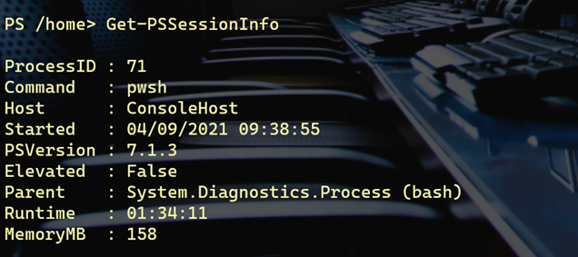

If you are running in a PowerShell console session, and the Elevated value is True, it will be displayed in color. The Memory and Runtime values are calculated ScriptProperties.

### [Out-Copy](docs/Out-Copy.md)

This command is intended for writers and those who need to document with PowerShell. You can pipe any command to this function, and you will get the regular output in your PowerShell session. Simultaneously, a copy of the output will be sent to the Windows clipboard. The copied output will include a prompt constructed from the current location unless you use the CommandOnly parameter.

You can run a command like this:

```powershell
Get-Process | Sort WS -Descending | Select -first 5 | Out-Copy
```

And this text will be copied to the clipboard.

```dos
PS C:\> Get-Process | Sort WS -Descending | Select -first 5

Handles  NPM(K)    PM(K)      WS(K)     CPU(s)     Id  SI ProcessName
-------  ------    -----      -----     ------     --  -- -----------
   1849     253   810320     820112     445.38  17860   1 firefox
    765      61   949028     758200      23.36   6052   0 sqlservr
    446     115   441860     471032      28.59  18204   1 Teams
   2307     192   313204     459616     325.23  15748   1 firefox
   2050     163   451744     433772      94.63  19780   1 thunderbird
```

### [Out-More](docs/Out-More.md)

This command provides a PowerShell alternative to the cmd.exe **MORE** command, which doesn't work in the PowerShell ISE. When you have screens of information, you can page it with this function.

```powershell
Get-Service | Out-More
```


This also works in PowerShell Core.

### [Out-ConditionalColor](docs/Out-ConditionalColor.md)

This command is designed to take pipeline input and display it in a colorized format, based on a set of conditions. Unlike `Write-Host`, which doesn't write to the pipeline, this command will write output to the pipeline. You can use a simple hashtable to define a color if the given property matches the hashtable key.


Or you can specify an ordered hashtable for more complex processing.


This command doesn't always work depending on the type of object you pipe to it. The problem appears to be related to the formatting system. Development and testing is ongoing.

### [Set-ConsoleTitle](docs/Set-ConsoleTitle.md)

Set the title bar of the current PowerShell console window.

```powershell
if (Test-IsAdministrator) {
  Set-ConsoleTitle "Administrator:  $($PSVersionTable.PSVersion)"
  }
```

### [Set-ConsoleColor](docs/Set-ConsoleColor.md)

Configure the foreground or background color of the current PowerShell console window. Note that if you are running the PSReadline module, this command won't work. You should use `Set-PSReadlineOption` or similar command to configure your session settings.

```powershell
Set-ConsoleColor -background DarkGray -foreground Yellow
```

### [Add-Border](docs/Add-Border.md)

This command will create a character or text-based border around a line of text. You might use this to create a formatted text report or to improve the display of information to the screen.

```dos
PS C:\> Add-Border $env:computername

*************
*   COWPC   *
*************
```

Starting in v2.23.0 you can also use ANSI escape sequences to color the text and/or the border.


```powershell
$params =@{
  textblock = (Get-PSWho -AsString ).trim()
  ANSIBorder = "`e[38;5;214m"
  Character = ([char]0x25CA)
  ANSIText = "`e[38;5;225m"
}
Add-Border @params
 ```

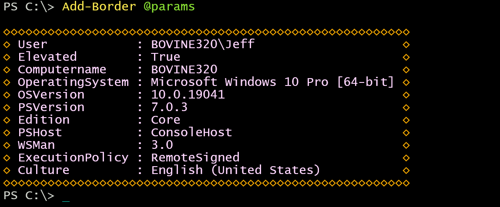

### [Show-Tree](docs/Show-Tree.md)

`Show-Tree` display the specified path as a graphical tree in the console. This is intended as a PowerShell alternative to the DOS `tree` command. This function should work for any type of PowerShell provider and can be used to explore providers used for configuration like the WSMan provider or the registry. By default, the output will only show directory or equivalent structures. But you can opt to include items well as item details.


If you are running PowerShell 7 and specifying a file system path, you can display the tree in a colorized format by using the `-InColor` dynamic parameter.

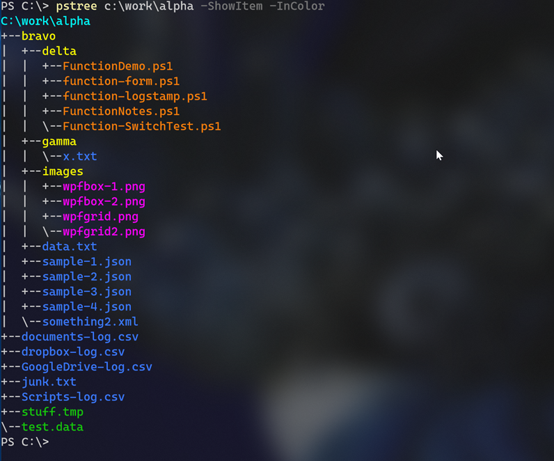

Beginning with module version 2.21.0, this command uses ANSI Color schemes from a JSON file. You can customize the file if you wish. See the [PSAnsiMap](#PSAnsiMap) section of this README.

This command has an alias of `pstree`.

```dos
PS C:\> pstree c:\work\alpha -files -properties LastWriteTime,Length

C:\work\Alpha\
+-- LastWriteTime = 02/28/2020 11:19:32
+--bravo
|  +-- LastWriteTime = 02/28/2020 11:20:30
|  +--delta
|  |  +-- LastWriteTime = 02/28/2020 11:17:35
|  |  +--FunctionDemo.ps1
|  |  |  +-- Length = 888
|  |  |  \-- LastWriteTime = 06/01/2009 15:50:47
|  |  +--function-form.ps1
|  |  |  +-- Length = 1117
|  |  |  \-- LastWriteTime = 04/17/2019 17:18:28
|  |  +--function-logstamp.ps1
|  |  |  +-- Length = 598
|  |  |  \-- LastWriteTime = 05/23/2007 11:39:55
|  |  +--FunctionNotes.ps1
|  |  |  +-- Length = 617
|  |  |  \-- LastWriteTime = 02/24/2016 08:59:03
|  |  \--Function-SwitchTest.ps1
|  |     +-- Length = 242
|  |     \-- LastWriteTime = 06/09/2008 15:55:44
|  +--gamma
...
```

This example is using parameter and command aliases. You can display a tree listing with files including user-specified properties. Use a value of * to show all properties.

### [New-RedGreenGradient](docs/New-RedGreenGradient.md)

`New-RedGreenGradient`, which displays a bar going from red to green. This might be handy when you want to present a visual indicator.

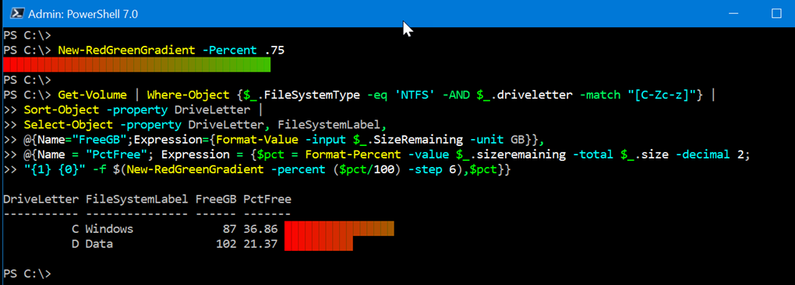

## Format Functions

The module contains a set of simple commands to make it easier to format values.

### [Format-Percent](docs/Format-Percent.md)

Treat a value as a percentage. This will write a [double] and not include the % sign.

```dos
PS C:\> Format-Percent -Value 123.5646MB -total 1GB -Decimal 4
12.0669
```

### [Format-String](docs/Format-String.md)

Use this command to perform one of several string manipulation "tricks".

```dos
PS C:\> Format-String "powershell" -Reverse -Case Proper
Llehsrewop
PS C:\> Format-String PowerShell -Randomize
wSlhoeePlr
PS C:\> Format-String "!MySecretPWord" -Randomize
-Replace @{S="$";e=&{Get-Random -min 1 -max 9};o="^"} -Reverse
yr7!^7WcMtr$Pd
```

### [Format-Value](docs/Format-Value.md)

This command will format a given numeric value. By default, it will treat the number as an integer. Or you can specify a certain number of decimal places. The command will also allow you to format the value in KB, MB, etc.

```dos
PS C:\>  Format-Value 1235465676 -Unit kb
1206509
PS C:\> Format-Value 123.45 -AsCurrency
$123.45
PS C:\> (Get-Process | measure-object ws -sum).sum |
Format-Value -Unit mb | Format-Value -AsNumber
9,437
```

Or pull it all together:

```powershell
Get-CimInstance win32_operatingsystem |
Select-Object @{Name = "TotalMemGB";
Expression={Format-Value $_.TotalVisibleMemorySize -Unit mb}},
@{Name="FreeMemGB";
Expression={Format-Value $_.FreePhysicalMemory -unit mb -Decimal 2}},
@{Name="PctFree";
Expression={Format-Percent -Value $_.FreePhysicalMemory `
-Total $_.totalVisibleMemorySize -Decimal 2}}
```

```dos
TotalMemGB FreeMemGB PctFree
---------- --------- -------
        32     14.05   44.06
```

## Scripting Tools

### [New-PSDynamicParameter](docs/New-PSDynamicParameter)

This command will create the code for a dynamic parameter that you can insert into your PowerShell script file. You need to specify a parameter name and a condition. The condition value is code that would run inside an If statement. Use a value like $True if you want to add it later in your scripting editor.

```powershell
PS C:\> New-PSDynamicParameter -Condition "$PSEdition -eq 'Core'" -ParameterName ANSI -Alias color -Comment "Create a parameter to use ANSI if running PowerShell 7" -ParameterType switch

    DynamicParam {
    # Create a parameter to use ANSI if running PowerShell 7
        If (Core -eq 'Core') {

        $paramDictionary = New-Object -Type System.Management.Automation.RuntimeDefinedParameterDictionary

        # Defining parameter attributes
        $attributeCollection = New-Object -Type System.Collections.ObjectModel.Collection[System.Attribute]
        $attributes = New-Object System.Management.Automation.ParameterAttribute
        $attributes.ParameterSetName = '__AllParameterSets'
        $attributeCollection.Add($attributes)

        # Adding a parameter alias
        $dynalias = New-Object System.Management.Automation.AliasAttribute -ArgumentList 'color'
        $attributeCollection.Add($dynalias)

        # Defining the runtime parameter
        $dynParam1 = New-Object -Type System.Management.Automation.RuntimeDefinedParameter('ANSI', [Switch], $attributeCollection)
        $paramDictionary.Add('ANSI', $dynParam1)

        return $paramDictionary
    } # end if
} #end DynamicParam
```

This creates dynamic parameter code that you can use in a PowerShell function. Normally you would save this output to a file or copy to the clipboard so that you can paste it into scripting editor.

You can also use a WPF-based front-end command, [New-PSDynamicParameterForm](docs/New-PSDynamicParameterForm.md). You can enter the values in the form. Required values are indicated by an asterisk.


Clicking `Create` will generate the dynamic parameter code and copy it to the Windows clipboard. You can then paste it into your scripting editor.

```powershell
DynamicParam {

    If ($Filter -eq 'domain') {

    $paramDictionary = New-Object -Type System.Management.Automation.RuntimeDefinedParameterDictionary

    # Defining parameter attributes
    $attributeCollection = New-Object -Type System.Collections.ObjectModel.Collection[System.Attribute]
    $attributes = New-Object System.Management.Automation.ParameterAttribute
    $attributes.ParameterSetName = '__AllParameterSets'
    $attributes.ValueFromPipelineByPropertyName = $True

    # Adding ValidatePattern parameter validation
    $value = '^\w+-\w+$'
    $v = New-Object System.Management.Automation.ValidatePatternAttribute($value)
    $AttributeCollection.Add($v)

    # Adding ValidateNotNullOrEmpty parameter validation
    $v = New-Object System.Management.Automation.ValidateNotNullOrEmptyAttribute
    $AttributeCollection.Add($v)
    $attributeCollection.Add($attributes)

    # Adding a parameter alias
    $dynalias = New-Object System.Management.Automation.AliasAttribute -ArgumentList 'cn'
    $attributeCollection.Add($dynalias)

    # Defining the runtime parameter
    $dynParam1 = New-Object -Type System.Management.Automation.RuntimeDefinedParameter('Computername', [String], $attributeCollection)
    $paramDictionary.Add('Computername', $dynParam1)

    return $paramDictionary
} # end if
} #end DynamicParam
```

If you import the PSScriptTools module in the PowerShell ISE, you will get a menu shortcut under Add-Ins.


If you import the module in VS Code using the integrated PowerShell terminal, it will a new command. In the command palette, use `PowerShell: Show Additional Commands from PowerShell Modules".


### [Get-PSUnique](docs/Get-PSUnique.md)

For the most part, objects you work with in PowerShell are guaranteed to be unique. But you might import data where there is the possibility of duplicate items. Consider this CSV sample.

```powershell
$Obj = "Animal,Snack,Color
Horse,Quiche,Chartreuse
Cat,Doritos,Red
Cat,Pringles,Yellow
Dog,Doritos,Yellow
Dog,Doritos,Yellow
Rabbit,Pretzels,Green
Rabbit,Popcorn,Green
Marmoset,Cheeseburgers,Black
Dog,Doritos,White
Dog,Doritos,White
Dog,Doritos,White
" | ConvertFrom-Csv
```

There are duplicate objects you might want to filter out. For that task, you can use `Get-PSUnique`.

```DOS
PS C:\> $obj | Get-PSUnique | Sort-Object animal


Animal   Snack         Color
------   -----         -----
Cat      Pringles      Yellow
Cat      Doritos       Red
Dog      Doritos       White
Dog      Doritos       Yellow
Horse    Quiche        Chartreuse
Marmoset Cheeseburgers Black
Rabbit   Popcorn       Green
Rabbit   Pretzels      Green
```

The duplicate items have been removed. This command works best with simple objects. If your objects have nested object properties, you will need to test if this command can properly filter for unique items.

### [Test-IsElevated](docs/Test-IsElevated.md)

This simple command will test if the current PowerShell session is running elevated, or as Administrator. On Windows platforms the function uses the .NET Framework to test. On non-Windows platforms, the command tests the user's UID value.

```dos
PS C:\> Test-IsElevated
False
```

You can also use the `Get-PSWho` command to get more information.

### [New-FunctionItem](docs/New-FunctionItem.md)

```powershell
{Get-Date -format g | Set-Clipboard} | New-FunctionItem -name Copy-Date
```

The scriptblock has been converted into a function.

```dos
PS C:\> get-command copy-date

CommandType     Name                        Version    Source
-----------     ----                        -------    ------
Function        Copy-Date
```

You can use this function to create a quick function definition directly from the console. This lets you quickly prototype a function. If you are happy with it, you can "export" to a file with `Show-FunctionItem`.

### [Show-FunctionItem](docs/Show-FunctionItem.md)

This command will display a loaded function as it might look in a code editor. You could use this command to export a loaded function to a file.

```powershell
Show-FunctionItem Copy-Date | Out-File c:\scripts\Copy-Date.ps1
```

### [ConvertTo-TitleCase](docs/ConvertToTitleCase.md)

This is a simple command that uses `[System.Globalization.CultureInfo]` to convert a string to title case.

```dos
PS C:\> ConvertTo-TitleCase "disk usage report"
Disk Usage Report
```

### [Trace-Message](docs/Trace-Message.md)

`Trace-Message` is designed to be used with your script or function on a Windows platform. Its purpose is to create a graphical trace window using Windows Presentation Foundation (WPF). Inside the function or script, you can use this command to send messages to the window. When finished, you have an option to save the output to a text file.

There are three steps to using this function. First, in your code, you need to create a boolean global variable called TraceEnabled. When the value is $True, the Trace-Message command will run. When set to false, the command will be ignored. Second, you need to initialize a form, specifying the title and dimensions. Finally, you can send trace messages to the window. All messages are prepended with a timestamp.

Here is a code excerpt from `$PSSamplePath\Get-Status.ps1`:

```powershell
Function Get-Status {

    [cmdletbinding(DefaultParameterSetName = 'name')]
    [alias("gst")]
    Param(
        ...
        [Parameter(HelpMessage="Enable with grapical trace window")]
        [switch]$Trace
    )

    Begin {
        Write-Verbose "[$((Get-Date).TimeofDay) BEGIN  ] Starting $($myinvocation.mycommand)"
        if ($trace) {
            $global:TraceEnabled = $True
            $traceTitle = "{0} Trace Log" -f $($myinvocation.MyCommand)
            Trace-Message -title $traceTitle
            Trace "Starting $($myinvocation.mycommand)"
        }
    } #begin
      Process {
        Write-Verbose "[$((Get-Date).TimeofDay) PROCESS] Using parameter set $($pscmdlet.ParameterSetName)"
        Trace-Message -message "Using parameter set: $($pscmdlet.ParameterSetName)"
    ...
      } #close function
    $data = Get-Status -trace
```

The trace window starts with pre-defined metadata.


*Your output might vary from this screenshot.*

You have an option to Save the text. The default location is `$env:temp`.

### [Get-CommandSyntax](docs/Get-CommandSyntax.md)

Some PowerShell commands are provider-aware and may have special syntax or parameters depending on what PSDrive you are using when you run the command. In Windows PowerShell, the help system could show you syntax based on a given path. However, this no longer appears to work. `Get-CommandSyntax` is intended as an alternative and should work in both Windows PowerShell and PowerShell 7.

Specify a cmdlet or function name, and the output will display the syntax detected when using different providers.

```powershell
Get-CommandSyntax -Name Get-Item
```

Dynamic parameters will be highlighted with an ANSI-escape sequence.

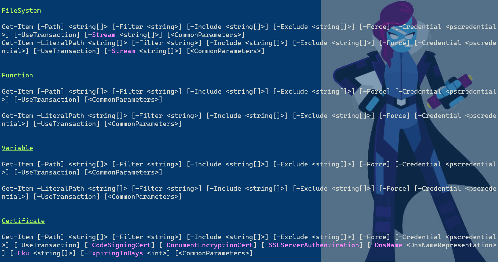

This command has an alias of *gsyn*.

### [Test-Expression](docs/Test-Expression.md)

The primary command can be used to test a PowerShell expression or scriptblock for a specified number of times and calculate the average runtime, in milliseconds, over all the tests.

#### Why

When you run a single test with `Measure-Command` the result might be affected by any number of factors. Likewise, running multiple tests may also be influenced by things such as caching. The goal in this module is to provide a test framework where you can run a test repeatedly with either a static or random interval between each test. The results are aggregated and analyzed. Hopefully, this will provide a more meaningful or realistic result.

#### Examples

The output will also show the median and trimmed values, as well as some metadata about the current PowerShell session.

```dos
PS C:\> $cred = Get-credential globomantics\administrator
PS C:\> Test-Expression {
  param($cred)
  Get-WmiObject win32_logicaldisk -computer chi-dc01 -credential $cred
  } -argumentList $cred

Tests        : 1
TestInterval : 0.5
AverageMS    : 1990.6779
MinimumMS    : 1990.6779
MaximumMS    : 1990.6779
MedianMS     : 1990.6779
TrimmedMS    :
PSVersion    :5.1.17763.134
OS           : Microsoft Windows 10 Pro
```

You can also run multiple tests with random time intervals.

```dos
PS C:\>Test-Expression {
  param([string[]]$Names)
  Get-Service $names
  } -count 5 -IncludeExpression -argumentlist @('bits','wuauserv','winrm') `
  -RandomMinimum .5 -RandomMaximum 5.5

Tests        : 5
TestInterval : Random
AverageMS    : 1.91406
MinimumMS    : 0.4657
MaximumMS    : 7.5746
MedianMS     : 0.4806
TrimmedMS    : 0.51
PSVersion    : 5.1.17763.134
OS           : Microsoft Windows 10 Pro
Expression   : param([string[]]$Names) Get-Service $names
Arguments    : {bits, wuauserv, winrm}
```

For very long-running tests, you can run them as a background job.

#### Graphical Testing

The module also includes a graphical command called `Test-ExpressionForm`. This is intended to serve as both an entry and results form.


When you quit the form the last result will be written to the pipeline including all metadata, the scriptblock and any arguments.

### [Copy-HelpExample](docs/Copy-HelpExample.md)

This command is designed to make it (slightly) easier to copy code snippets from help examples. Specify the name of a function or cmdlet, presumably one with documented help examples, and you will be offered a selection of code snippets to copy to the clipboard. Code snippets have been trimmed of blank lines, most prompts, and comments. Many examples include command output. You will have to manually remove what you don't want after pasting.

The default behavior is to use a console-based menu, which works cross-platform.


Enter the number of the code to copy to the clipboard. Enter multiple numbers separated by commas.

If you are running a Windows platform, there is a dynamic help parameter to use `Out-Gridview`.

```powershell
Copy-HelpExample Stop-Service -UseGridView
```


If you are running this in the PowerShell ISE this is the default behavior, even if you don't specify the parameter.

### [Get-GitSize](docs/Get-GitSize.md)

Use this command to determine how much space the hidden `.git` folder is consuming.

```dos
PS C:\scripts\PSScriptTools> Get-GitSize

Path                                          Files          SizeKB
----                                          -----          ------
C:\scripts\PSScriptTools                        751       6859.9834
```

This is the default formatted view. The object has other properties you can use.

```dos
Name         : PSScriptTools
Path         : C:\scripts\PSScriptTools
Files        : 751
Size         : 7024623
Date         : 3/5/2020 2:57:06 PM
Computername : BOVINE320
```

### [Remove-MergedBranch](docs/Remove-MergedBranch.md)

When using `git` you may create a number of branches. Presumably, you merge these branches into the main or master branch. You can use this command to remove all merged branches other than `master` and the current branch. You must be in the root of your project to run this command.

```dos
PS C:\MyProject> Remove-MergedBranch

Remove merged branch from MyProject?
2.1.1
[Y] Yes  [N] No  [S] Suspend  [?] Help (default is "Y"): n

Remove merged branch from MyProject?
dev1
[Y] Yes  [N] No  [S] Suspend  [?] Help (default is "Y"): y
Deleted branch dev1 (was 75f6ab8).

Remove merged branch from MyProject?
dev2
[Y] Yes  [N] No  [S] Suspend  [?] Help (default is "Y"): y
Deleted branch dev2 (was 75f6ab8).

Remove merged branch from MyProject?
patch-254
[Y] Yes  [N] No  [S] Suspend  [?] Help (default is "Y"): n

PS C:\MyProject>
```

By default, you will be prompted to remove each branch.

### [Test-WithCulture](docs/Test-WithCulture.md)

When writing PowerShell commands, sometimes the culture you are running under becomes critical. For example, European countries use a different datetime format than North Americans, which might present a problem with your script or command. Unless you have a separate computer running under the foreign culture, it is difficult to test. This command will allow you to test a scriptblock or even a file under a different culture, such as DE-DE for German.

```dos
PS C:\> Test-WithCulture fr-fr -Scriptblock {
    Get-winEvent -log system -max 500 |
    Select-Object -Property TimeCreated,ID,OpCodeDisplayname,Message |
    Sort-Object -property TimeCreated |
    Group-Object {$_.TimeCreated.ToShortDateString()} -NoElement}

Count Name
----- ----
  165 10/07/2019
  249 11/07/2019
   17 12/07/2019
   16 13/07/2019
   20 14/07/2019
   26 15/07/2019
    7 16/07/2019
```

### [Copy-Command](docs/Copy-Command.md)

This command will copy a PowerShell command, including parameters and help to a new user-specified command. You can use this to create a "wrapper" function or to easily create a proxy function. The default behavior is to create a copy of the command complete with the original comment-based help block.

### [Get-ParameterInfo](docs/Get-ParameterInfo.md)

Using `Get-Command`, this function will return information about parameters for any loaded cmdlet or function. The common parameters like `Verbose` and `ErrorAction` are omitted. `Get-ParameterInfo` returns a custom object with the most useful information an administrator might need to know. The custom object includes default format views for a list and table.


### [New-PSFormatXML](docs/New-PSFormatXML.md)

When defining custom objects with a new typename, PowerShell by default will display all properties. However, you may wish to have a specific default view, be it a table or list. Or you may want to have different views display the object differently. Format directives are stored in format.ps1xml files which can be tedious to create. This command simplifies that process.

Define a custom object:

```powershell
$tname = "myThing"
$obj = [PSCustomObject]@{
  PSTypeName   = $tname
  Name         = "Jeff"
  Date         = (Get-Date)
  Computername = $env:computername
  OS           = (Get-CimInstance win32_operatingsystem).caption
}
$upParams = @{
  TypeName = $tname
  MemberType = "ScriptProperty"
  MemberName = "Runtime"
  value =  {(Get-Date) - [datetime]"1/1/2019"}
  force = $True
}
Update-TypeData @upParams
```

The custom object looks like this by default:

```dos
PS C:\> $obj

Name         : Jeff
Date         : 2/10/2019 8:49:10 PM
Computername : BOVINE320
OS           : Microsoft Windows 10 Pro
Runtime      : 40.20:49:43.9205882
```

Now you can create new formatting directives.

```powershell
$tname = "myThing"
$params = @{
  Properties = "Name","Date","Computername","OS"
  FormatType = "Table"
  Path = "C:\scripts\$tname.format.ps1xml"
}
$obj | New-PSFormatXML @params

$params.Properties= "Name","OS","Runtime"
$params.Add("Viewname","runtime")
$params.Add(Append,$True)
$obj | New-PSFormatXML  @params

$params.formatType = "list"
$params.remove("Properties")
$obj | New-PSFormatXML @params

Update-FormatData -appendpath $params.path
```

And here is what the object looks like now:

```dos
PS C:\> $obj

Name Date                 Computername Operating System
---- ----                 ------------ ----------------
Jeff 2/10/2019 8:49:10 PM BOVINE320    Microsoft Windows 10 Pro

PS C:\> $obj | Format-Table -View runtime

Name OS Runtime
---- -- -------
Jeff    40.20:56:24.5411481

PS C:\> $obj | Format-List


Name            : Jeff
Date            : Sunday, February 10, 2019
Computername    : BOVINE320
OperatingSystem : Microsoft Windows 10 Pro
Runtime         : 40.21:12:01
```

Starting with v2.31.0, you can also use a hashtable to define custom properties from scriptblocks.

```powershell
 $p = @{
    FormatType = "List"
    ViewName = "run"
    Path  = "c:\scripts\run.ps1xml"
    Properties = "ID","Name","Path","StartTime",
    @{Name="Runtime";Expression={(Get-Date) - $_.starttime}}
 }
 Get-Process -id $pid | New-PSFormatXML @p
 ```

If you run this command from Visual Studio Code and specify `-Passthru`, the resulting file will be opened in your editor.

### [Test-IsPSWindows](docs/Test-IsPSWindows.md)

PowerShell Core introduced the `$IsWindows` variable. However, it is not available on Windows PowerShell. Use this command to perform a simple test if the computer is either running Windows or using the Desktop PSEdition. The command returns `True` or `False`.

### [Write-Detail](docs/Write-Detail.md)

This command is designed to be used within your functions and scripts to make it easier to write a detailed message that you can use as verbose output. The assumption is that you are using an advanced function with a `Begin`, `Process` and `End` scriptblocks. You can create a detailed message to indicate what part of the code is being executed. The output can be configured to include a datetime stamp or just the time.

```dos
PS C:\> write-detail "Getting file information" -Prefix Process -Date
9/15/2020 11:42:43 [PROCESS] Getting file information
```

In a script you might use it like this:

```powershell
Begin {
    Write-Detail "Starting $($myinvocation.mycommand)" -Prefix begin -time |
    Write-Verbose
    $tabs = "`t" * $tab
    Write-Detail "Using a tab of $tab" -Prefix BEGIN -time | Write-Verbose
} #begin
```

### [Save-GitSetup](docs/Save-GitSetup.md)

This command is intended for Windows users to easily download the latest 64bit version of `Git`.

```dos
PS C:\> Save-GitSetup -Path c:\work -Passthru


    Directory: C:\work

Mode                 LastWriteTime         Length Name
----                 -------------         ------ ----
-a---           1/23/2020  4:31 PM       46476880 Git-2.25.0-64-bit.exe
```

You will need to manually install the file. Or you can try something like this:

```powershell
Save-GitSetup -Path c:\work -Passthru | Invoke-Item
```

## ANSI Tools

This module includes several custom format files for common objects like services. You can run `Get-Service` and pipe it to the custom table view.

```powershell
Get-Service | Format-Table -view ansi
```

This will display the service status color-coded.

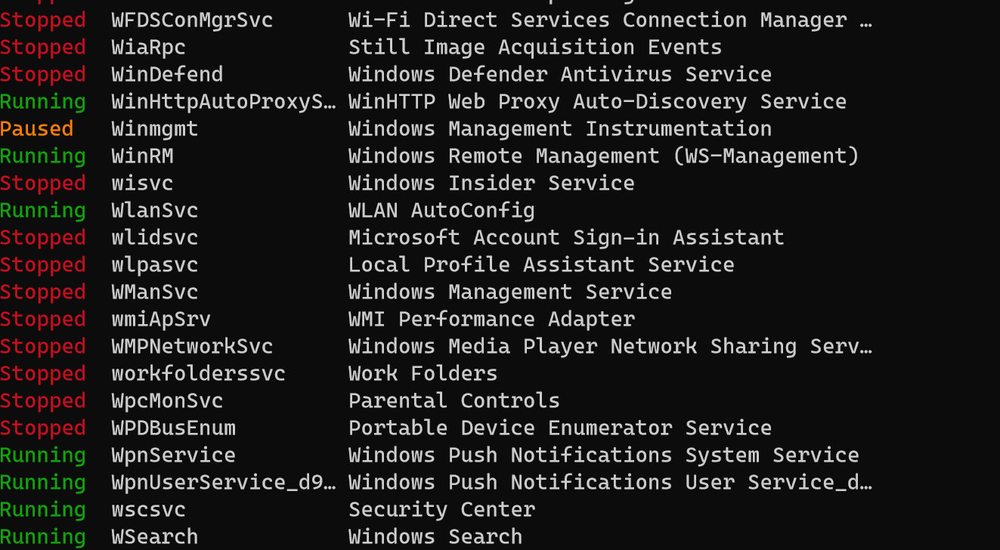

**ANSI formatting will only work in a PowerShell 5.1 console window or VS Code. It will not display properly in the PowerShell ISE, or older versions of PowerShell.**

### PSAnsiMap

I have done something similar for output from `Get-ChildItem`. The module includes a JSON file that is exported as a global variable called `PSAnsiFileMap`.

```dos
PS C:\> $PSAnsiFileMap

Description    Pattern                                Ansi
-----------    -------                                ----
PowerShell     \.ps(d|m)?1$
Text           \.(txt)|(md)|(log)$
DataFile       \.(json)|(xml)|(csv)$
Executable     \.(exe)|(bat)|(cmd)|(sh)$
Graphics       \.(jpg)|(png)|(gif)|(bmp)|(jpeg)$
Media          \.(mp3)|(m4v)|(wav)|(au)|(flac)|(mp4)$
Archive        \.(zip)|(rar)|(tar)|(gzip)$
TopContainer
ChildContainer
```

The map includes ANSI settings for different file types. You won't see the ANSI value in the output. The module will add a custom table view called `ansi` which you can use to display colorized file results.

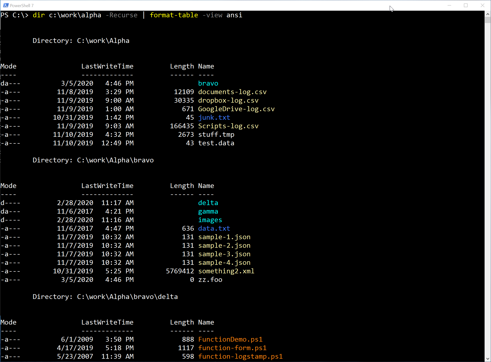

The mapping file is user-customizable. Copy the `psansifilemap.json` file from the module's root directory to $HOME. When you import this module, if the file is found, it will be imported and used as `psansifilemap`, otherwise, the module's file will be used.

The file will look like this:

```json
[
  {
    "Description": "PowerShell",
    "Pattern": "\\.ps(d|m)?1$",
    "Ansi": "\u001b[38;2;252;127;12m"
  },
  {
    "Description": "Text",
    "Pattern": "\\.(txt)|(md)|(log)$",
    "Ansi": "\u001b[38;2;58;120;255m"
  },
  {
    "Description": "DataFile",
    "Pattern": "\\.(json)|(xml)|(csv)$",
    "Ansi": "\u001b[38;2;249;241;165m"
  },
  {
    "Description": "Executable",
    "Pattern": "\\.(exe)|(bat)|(cmd)|(sh)$",
    "Ansi": "\u001b[38;2;197;15;31m"
  },
  {
    "Description": "Graphics",
    "Pattern": "\\.(jpg)|(png)|(gif)|(bmp)|(jpeg)$",
    "Ansi": "\u001b[38;2;255;0;255m"
  },
  {
    "Description": "Media",
    "Pattern": "\\.(mp3)|(m4v)|(wav)|(au)|(flac)|(mp4)$",
    "Ansi": "\u001b[38;2;255;199;6m"
  },
  {
    "Description": "Archive",
    "Pattern": "\\.(zip)|(rar)|(tar)|(gzip)$",
    "Ansi": "\u001b[38;2;118;38;113m"
  },
  {
    "Description": "TopContainer",
    "Pattern": "",
    "Ansi": "\u001b[38;2;0;255;255m"
  },
  {
    "Description": "ChildContainer",
    "Pattern": "",
    "Ansi": "\u001b[38;2;255;255;0m"
  }
]
```

You can create or modify file groups. The Pattern value should be a regular expression pattern to match the filename. Don't forget you will need to escape characters for the JSON format. The Ansi value will be an ANSI escape sequence. You can use `\u001b` for the \``e` character.

If you prefer not to edit JSON files, you can use the PSAnsiFileMap commands from this module.

### [Get-PSAnsiFileMap](docs/Get-PSAnsiFileMap.md)

This command will display the value of the `$PSAnsiFileMap` variable, but will also show the ANSI sequence using the sequence itself.


### [Set-PSAnsiFileMap](docs/Set-PSAnsiFileMap.md)

Use this command to modify an existing entry. You need to specify a regular expression pattern to match on the filename and/or an ANSI escape sequence. If the entry description doesn't exist, you will need to specify the regex pattern and the ANSI sequence to add the entry to $PSAnsiFileMap.

```powershell
Set-PSAnsiFileMap Archive -Ansi "`e[38;5;75m"
```

### [Remove-PSAnsiFileEntry](docs/Remove-PSAnsiFileEntry.md)

If you need to, you can remove an entry from `$PSAnsiFileMap`.

```powershell
Remove-PSAnsiFileEntry DevFiles
```

### [Export-PSAnsiFileMap](docs/Export-PSAnsiFileMap.md)

Any changes you make to `$PSAnsiFileMap` will only last until you import the module again. To make the change permanent, use [Export-PSAnsiFileMap](docs/Export-PSAnsiFileMap.md). This will create the `psansifilemap.json` file in your `$HOME` directory. When you import the PSSCriptTools module, if this file is found, it will be imported. Otherwise, the default module file will be used.

### [Convert-HtmlToAnsi](docs/Convert-HtmlToAnsi.md)

This simple function is designed to convert an HTML color code like #ff5733 into an ANSI escape sequence.

```text
PS C:\> Convert-HtmlToAnsi "#ff5733"
[38;2;255;87;51m
```

To use the resulting value you still need to construct an ANSI string with the escape character and the closing [0m.


In PowerShell 7 you can use `` `e ``. Or `$([char]27)` which works in all PowerShell versions.

### [New-ANSIBar](docs/New-ANSIBar.md)

You can use this command to create colorful bars using ANSI escape sequences based on a 256 color scheme. The default behavior is to create a gradient bar that goes from first to last values in the range and then back down again. Or you can create a single gradient that runs from the beginning of the range to the end. You can use one of the default characters or specify a custom one.


### [Write-ANSIProgress](docs/Write-ANSIProgress.md)

You could also use `Write-ANSIProgress` to show a custom ANSI bar.


Or you can use it in your code to display a console progress bar.

```powershell
$sb = {
  Clear-Host
  $top = Get-ChildItem c:\scripts -Directory
  $i = 0
  $out=@()
  $pos = $host.ui.RawUI.CursorPosition
  Foreach ($item in $top) {
      $i++
      $pct = [math]::round($i/$top.count,2)
      Write-ANSIProgress -PercentComplete $pct -position $pos
      Write-Host "  Processing $(($item.fullname).padright(80))"
      -ForegroundColor Yellow -NoNewline
      $out+= Get-ChildItem -path $item -Recurse -file |
      Measure-Object -property length -sum |
      Select-Object @{Name="Path";Expression={$item.fullname}},Count,
      @{Name="Size";Expression={$_.Sum}}
  }
  Write-Host ""
  $out | Sort-Object -property Size -Descending
    }
```


### [Show-ANSISequence](docs/Show-ANSISequence.md)

You can use `Show-ANSISequence` to preview how it will look in your PowerShell session. You might get a difference appearance in Windows Terminal depending on the color scheme you are using.

The default behavior is to show basic sequences.


You can also view foreground and or background settings.


You can even use an RGB value.


The escape character will match what is acceptable in your version of PowerShell. These screen shots are showing PowerShell 7.

## Other Module Features

From time to time, I will include additional items that you might find useful in your PowerShell work.

### Custom Format Views

The module includes several custom format.ps1xml files that define additional views for common objects. Some of these have already been demonstrated elsewhere in this document.

For example, there is a custom table view for Aliases.

```dos
PS C:\> Get-Alias | Sort-Object Source | Format-Table -view Source


   Source:

Name                 Definition
----                 ----------
nmo                  New-Module
ni                   New-Item
npssc                New-PSSessionConfigurationFile
nv                   New-Variable
nsn                  New-PSSession
...

   Source: Microsoft.PowerShell.Management 3.1.0.0

Name                 Definition
----                 ----------
gtz                  Get-TimeZone
stz                  Set-TimeZone
...


   Source: Microsoft.PowerShell.Utility 3.1.0.0

Name                 Definition
----                 ----------
fhx                  Format-Hex
CFS                  ConvertFrom-String


   Source: PSScriptTools 2.31.0

Name                 Definition
----                 ----------
clr                  Convert-EventLogRecord
gsi                  Get-FolderSizeInfo
wver                 Get-WindowsVersion
gpi                  Get-ParameterInfo
che                  Copy-HelpExample
...
```

Some custom formats use ANSI to highlight information, assuming you are running in PowerShell Console Host.


In this format view, ReadOnly aliases are displayed in Red.

Use [Get-FormatView](docs/Get-FormatView.md) to discover available format views. Or if you'd like to create your own custom views look at [New-PSFormatXML](docs/New-PSFormatXML.md)

### Custom Type Extensions

When you import the module, you will also get custom type extensions. These are designed to make it easier to work with common objects in PowerShell.

#### System.IO.FileInfo

The module will extend file objects with the following alias properties:

| New Alias | Property |
| --- | --- |
| Size | Length |
| Created | CreationTime |
| Modified | LastWriteTime |

You also have new script properties

| Script Property | Description |
| --- | --- |
| ModifiedAge | A timespan between the current date the and last write time |
| CreatedAge | A timespan between the current date the and creation time |
| SizeKB | The file size formatted in KB to 2 decimal places |
| SizeMB | The file size formatted in MB to 2 decimal places |

```dos
PS C:\> Get-Childitem C:\work\pswork.xml | Select-Object Name,Size,SizeKB,SizeMB,Created,CreatedAge,Modified,ModifiedAge

Name        : pswork.xml
Size        : 32072432
SizeKB      : 31320.73
SizeMB      : 30.59
Created     : 1/5/2021 6:46:43 PM
CreatedAge  : 175.17:47:00.4966770
Modified    : 1/6/2021 11:53:20 AM
ModifiedAge : 175.00:40:23.3527674
```

#### System.Diagnostics.Process

The module will extend process objects with a `Runtime` script property.

```dos
PS C:\> Get-Process | Sort-Object runtime -Descending |
Select-Object -first 5 -Property ID,Name,Runtime

 Id Name          Runtime
 -- ----          -------
120 Secure System 20:44:51.6139043
204 Registry      20:44:51.3661961
  4 System        20:44:48.2820565
704 smss          20:44:48.2726401
820 csrss         20:44:44.7760844
```

The Idle process will have a null value for this property.

### PSSpecialChar

A number of the commands in this module can use special characters. To make it easier, when you import the module, it will create a global variable that is a hash table of common special characters. Because it is a hashtable, you can add to it.


The names are the same as used in `CharMap.exe`. Don't let the naming confuse you. It may say `BlackSquare`, but the color will depend on how you use it.

```powershell
Get-WindowsVersionString |
Add-Border -border $PSSpecialChar.BlackSmallSquare `
-ANSIBorder "$([char]0x1b)[38;5;214m"
```


### Sample Scripts

This PowerShell module contains several functions you might use to enhance your own functions and scripts. The [Samples](samples) folder contains demonstration script files. You can access the folder in PowerShell using the `$PSSamplePath`.

```powershell
dir $pssamplepath
```

The samples provide suggestions on how you might use some of the commands in this module. The scripts are offered **AS-IS** and are for demonstration purposes only.

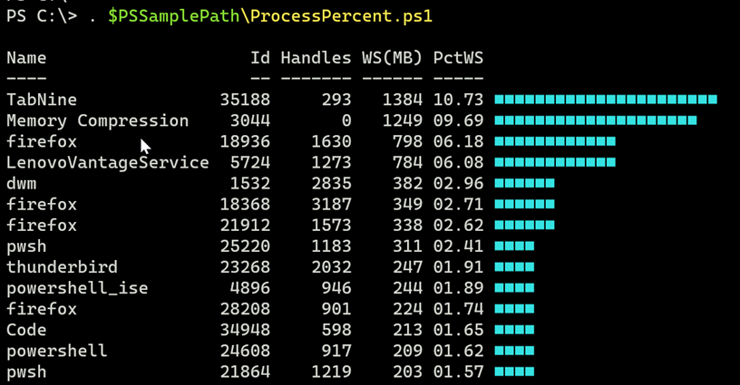

### [Open-PSScriptToolsHelp](docs/Open-PSScriptToolsHelp.md)

I've created a PDF version of this document which I thought you might find useful since it includes screen shots and sample output rendered nicer than what you can get in PowerShell help. Run `Open-PSScriptToolsHelp` to open the PDF using your default associated application.

## Related Modules

If you find this module useful, you might also want to look at my PowerShell tools for:

+ [Keeping up to date with PowerShell 7.x releases](https://github.com/jdhitsolutions/PSReleaseTools)
+ [Reporting on Active Directory](https://github.com/jdhitsolutions/ADReportingTools)
+ [Creating and managing custom type extensions](https://github.com/jdhitsolutions/PSTypeExtensionTools)
+ [Managing scheduled jobs](https://github.com/jdhitsolutions/ScheduledJobTools)
+ [Running remote commands outside of PowerShell Remoting](https://github.com/jdhitsolutions/PSRemoteOperations).
+ [Automating the PowerShell scripting process](https://github.com/jdhitsolutions/PSFunctionTools)
+ [A simple command-line task and to-do manager](https://github.com/jdhitsolutions/MyTasks)

## Compatibility

Where possible, module commands have been tested with PowerShell 7.x, but not on every platform. If you encounter problems, have suggestions, or other feedback, please post an [issue](https://github.com/jdhitsolutions/PSScriptTools/issues). It is assumed you will **not** be running these commands on any edition of PowerShell Core, i.e PowerShell 6.x.
